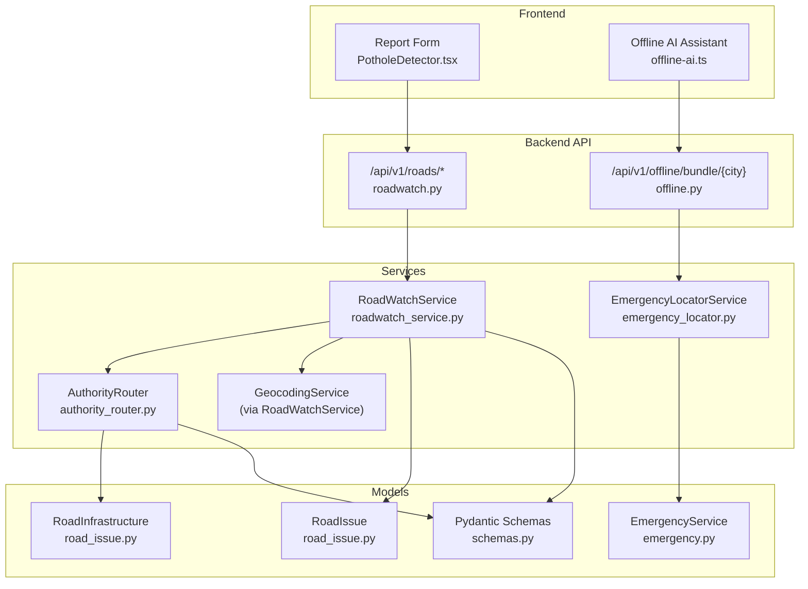
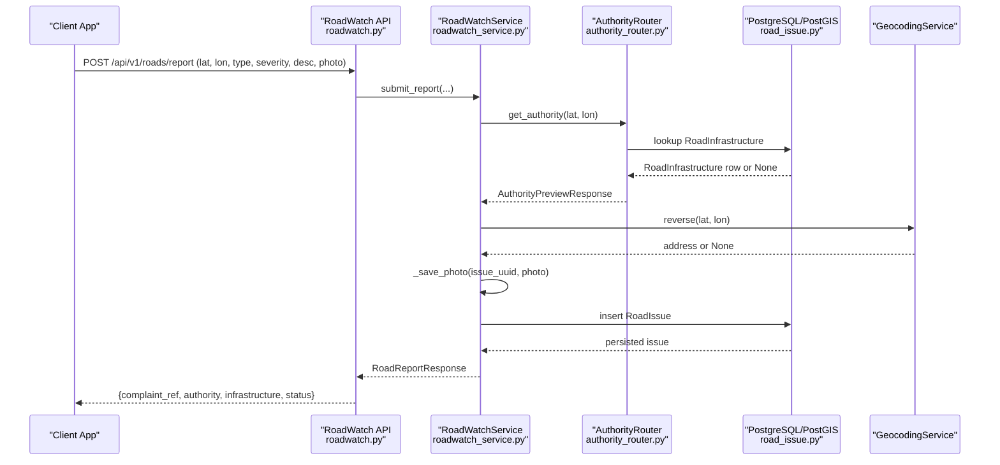
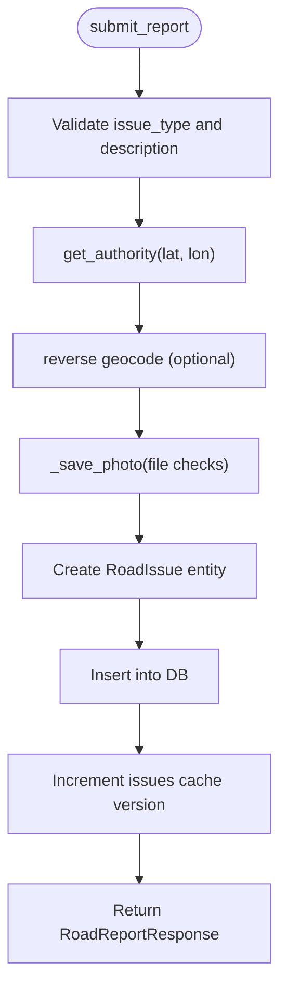
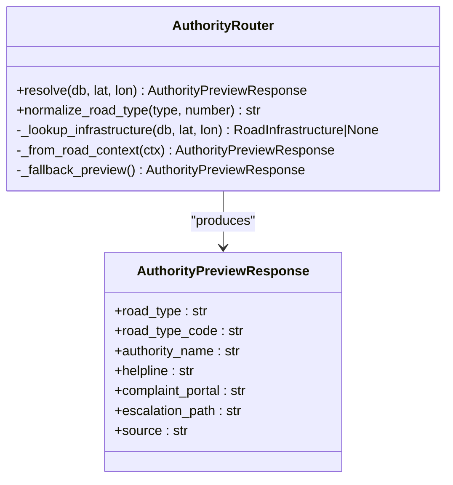
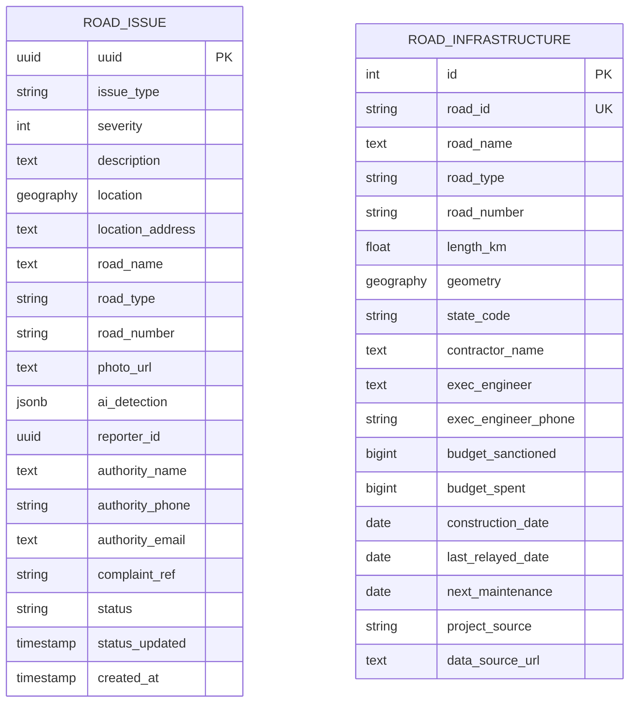
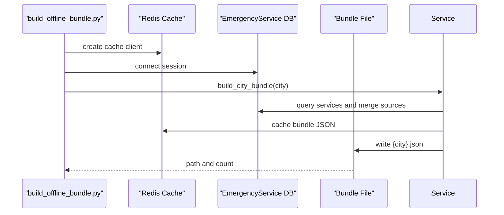
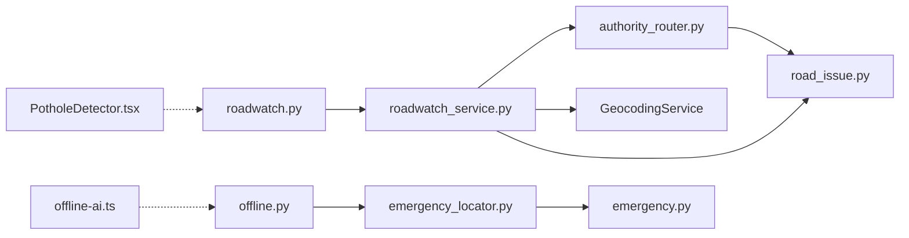

# Road Reporter (RoadWatch)

<cite>
**Referenced Files in This Document**
- [roadwatch.py](file://backend/api/v1/roadwatch.py)
- [roadwatch_service.py](file://backend/services/roadwatch_service.py)
- [authority_router.py](file://backend/services/authority_router.py)
- [road_issue.py](file://backend/models/road_issue.py)
- [schemas.py](file://backend/models/schemas.py)
- [offline.py](file://backend/api/v1/offline.py)
- [offline-ai.ts](file://frontend/lib/offline-ai.ts)
- [PotholeDetector.tsx](file://frontend/components/PotholeDetector.tsx)
- [edge-ai.ts](file://frontend/lib/edge-ai.ts)
- [emergency_locator.py](file://backend/services/emergency_locator.py)
- [emergency.py](file://backend/models/emergency.py)
- [build_offline_bundle.py](file://backend/scripts/app/build_offline_bundle.py)
</cite>

## Table of Contents
1. [Introduction](#introduction)
2. [Project Structure](#project-structure)
3. [Core Components](#core-components)
4. [Architecture Overview](#architecture-overview)
5. [Detailed Component Analysis](#detailed-component-analysis)
6. [Dependency Analysis](#dependency-analysis)
7. [Performance Considerations](#performance-considerations)
8. [Troubleshooting Guide](#troubleshooting-guide)
9. [Conclusion](#conclusion)
10. [Appendices](#appendices)

## Introduction
Road Reporter (RoadWatch) enables citizens and field workers to report road issues with geotags and optional photos. It integrates an AI-powered authority routing system to automatically route reports to the correct department (NHAI, State PWD, PMGSY, etc.) based on road classification derived from spatial context. The system supports spatial queries, issue categorization, and community reporting workflows. It also includes offline capabilities for emergency services and a simulated AI detector UI for potholes.

RoadWatch is designed for both online and offline environments:
- Online: Real-time spatial queries, authority resolution, and photo uploads.
- Offline: Prebuilt emergency bundles and a lightweight offline AI assistant for basic responses.

## Project Structure
The RoadWatch module spans backend APIs, services, models, and frontend components:
- Backend API exposes endpoints for nearby issues, authority preview, infrastructure info, and report submission.
- Services encapsulate spatial logic, authority routing, geocoding, and photo validation.
- Models define road issues and infrastructure entities with PostGIS geography fields.
- Frontend provides a camera-based UI for pothole detection and offline AI assistant.

**Diagram sources**
- [roadwatch.py:19-97](file://backend/api/v1/roadwatch.py#L19-L97)
- [roadwatch_service.py:56-325](file://backend/services/roadwatch_service.py#L56-L325)
- [authority_router.py:42-143](file://backend/services/authority_router.py#L42-L143)
- [road_issue.py:14-66](file://backend/models/road_issue.py#L14-L66)
- [schemas.py:83-161](file://backend/models/schemas.py#L83-L161)
- [offline.py:11-28](file://backend/api/v1/offline.py#L11-L28)
- [emergency_locator.py:161-507](file://backend/services/emergency_locator.py#L161-L507)
- [PotholeDetector.tsx:11-146](file://frontend/components/PotholeDetector.tsx#L11-L146)
- [offline-ai.ts:1-256](file://frontend/lib/offline-ai.ts#L1-L256)

**Section sources**
- [roadwatch.py:19-97](file://backend/api/v1/roadwatch.py#L19-L97)
- [roadwatch_service.py:56-325](file://backend/services/roadwatch_service.py#L56-L325)
- [authority_router.py:42-143](file://backend/services/authority_router.py#L42-L143)
- [road_issue.py:14-66](file://backend/models/road_issue.py#L14-L66)
- [schemas.py:83-161](file://backend/models/schemas.py#L83-L161)
- [offline.py:11-28](file://backend/api/v1/offline.py#L11-L28)
- [emergency_locator.py:161-507](file://backend/services/emergency_locator.py#L161-L507)
- [PotholeDetector.tsx:11-146](file://frontend/components/PotholeDetector.tsx#L11-L146)
- [offline-ai.ts:1-256](file://frontend/lib/offline-ai.ts#L1-L256)

## Core Components
- RoadWatch API: Exposes endpoints to query nearby issues, resolve authority, fetch infrastructure details, and submit reports.
- RoadWatch Service: Implements spatial queries, authority resolution, geocoding, photo validation, and report persistence.
- Authority Router: Determines responsible authority based on road type and number, with fallback to OSM context.
- Models: Define road issues and infrastructure with PostGIS geography fields and JSONB for AI metadata.
- Schemas: Pydantic models for API responses and typed requests.
- Offline Emergency Bundles: Prebuilt JSON bundles for offline emergency services discovery.
- Frontend Detector UI: Simulated pothole detection UI; offline AI assistant for basic responses.

**Section sources**
- [roadwatch.py:26-97](file://backend/api/v1/roadwatch.py#L26-L97)
- [roadwatch_service.py:56-325](file://backend/services/roadwatch_service.py#L56-L325)
- [authority_router.py:42-143](file://backend/services/authority_router.py#L42-L143)
- [road_issue.py:14-66](file://backend/models/road_issue.py#L14-L66)
- [schemas.py:83-161](file://backend/models/schemas.py#L83-L161)
- [offline.py:18-28](file://backend/api/v1/offline.py#L18-L28)
- [emergency_locator.py:241-299](file://backend/services/emergency_locator.py#L241-L299)
- [PotholeDetector.tsx:11-146](file://frontend/components/PotholeDetector.tsx#L11-L146)
- [offline-ai.ts:1-256](file://frontend/lib/offline-ai.ts#L1-L256)

## Architecture Overview
RoadWatch orchestrates spatial queries, authority routing, and reporting workflows. At runtime:
- Clients call RoadWatch endpoints to find nearby issues, resolve authority, or submit reports.
- The service resolves the authority using spatial road infrastructure or OSM context.
- Optional reverse geocoding enriches the report with an address.
- Photos are validated and stored; a complaint reference is generated.
- Responses include authority contact and infrastructure details.

**Diagram sources**
- [roadwatch.py:73-97](file://backend/api/v1/roadwatch.py#L73-L97)
- [roadwatch_service.py:186-253](file://backend/services/roadwatch_service.py#L186-L253)
- [authority_router.py:48-79](file://backend/services/authority_router.py#L48-L79)
- [road_issue.py:14-40](file://backend/models/road_issue.py#L14-L40)

## Detailed Component Analysis

### RoadWatch API Endpoints
- GET /api/v1/roads/issues: Find nearby road issues within a radius, filtered by status.
- GET /api/v1/roads/authority: Resolve authority and infrastructure preview for a coordinate.
- GET /api/v1/roads/infrastructure: Retrieve infrastructure details near a coordinate.
- POST /api/v1/roads/report: Submit a new road issue with optional photo.

Validation and error handling:
- Query parameters are validated (bounds, limits, statuses).
- Submission validates issue type length and photo content type/magic bytes.
- Service errors are surfaced as HTTP 422.

**Section sources**
- [roadwatch.py:26-97](file://backend/api/v1/roadwatch.py#L26-L97)

### RoadWatch Service
Responsibilities:
- Authority resolution: Uses cached or computed authority preview.
- Infrastructure lookup: Finds nearest road segment within a small radius.
- Spatial queries: Distance-based filtering with PostGIS geography.
- Photo handling: Validates content type and magic bytes, enforces size limits, stores securely, and returns a URL.
- Report creation: Builds a RoadIssue record with authority and address metadata.

Key behaviors:
- Caching: Issues and authority/infras caches are versioned and TTL-controlled.
- Status normalization: Supports open, acknowledged, in_progress, resolved, rejected.
- Reverse geocoding: Optional enrichment with display name.

**Diagram sources**
- [roadwatch_service.py:186-253](file://backend/services/roadwatch_service.py#L186-L253)
- [roadwatch_service.py:275-325](file://backend/services/roadwatch_service.py#L275-L325)

**Section sources**
- [roadwatch_service.py:56-325](file://backend/services/roadwatch_service.py#L56-L325)

### Authority Routing System
AuthorityRouter determines jurisdiction based on:
- Direct road infrastructure match (nearest road segment).
- Fallback to OSM road context if infrastructure is missing.
- Normalization of road types (NH, SH, MDR, Village/PMGSY, Urban) to authority matrix entries.

**Diagram sources**
- [authority_router.py:42-143](file://backend/services/authority_router.py#L42-L143)
- [schemas.py:83-101](file://backend/models/schemas.py#L83-L101)

**Section sources**
- [authority_router.py:42-143](file://backend/services/authority_router.py#L42-L143)
- [schemas.py:83-101](file://backend/models/schemas.py#L83-L101)

### Spatial Data Models
RoadIssue and RoadInfrastructure use PostGIS geography fields for precise spatial indexing and distance calculations. RoadIssue includes:
- UUID, issue_type, severity, description
- Location (POINT), address, road metadata
- Authority info and complaint reference
- AI detection metadata (JSONB)
- Status and timestamps

RoadInfrastructure includes:
- Unique road identifiers, name, type, number
- Geometry (LINESTRING) for spatial proximity
- Contractor/engineer details and budgets

**Diagram sources**
- [road_issue.py:14-66](file://backend/models/road_issue.py#L14-L66)

**Section sources**
- [road_issue.py:14-66](file://backend/models/road_issue.py#L14-L66)

### Offline Emergency Bundles and Offline AI
Offline bundle building:
- Script generates per-city JSON bundles containing emergency services and national numbers.
- Bundle includes source attribution and is cached for reuse.

Offline AI assistant:
- Frontend provides a simulated offline AI with three tiers: system AI, Transformers.js model, and keyword fallback.
- UI component PotholeDetector.tsx visually demonstrates a scanning HUD and confidence overlay.

**Diagram sources**
- [build_offline_bundle.py:14-47](file://backend/scripts/app/build_offline_bundle.py#L14-L47)
- [emergency_locator.py:241-299](file://backend/services/emergency_locator.py#L241-L299)

**Section sources**
- [offline.py:18-28](file://backend/api/v1/offline.py#L18-L28)
- [build_offline_bundle.py:14-47](file://backend/scripts/app/build_offline_bundle.py#L14-L47)
- [emergency_locator.py:241-299](file://backend/services/emergency_locator.py#L241-L299)
- [offline-ai.ts:1-256](file://frontend/lib/offline-ai.ts#L1-L256)
- [PotholeDetector.tsx:11-146](file://frontend/components/PotholeDetector.tsx#L11-L146)

## Dependency Analysis
- API depends on RoadWatchService and Pydantic schemas.
- RoadWatchService depends on AuthorityRouter, GeocodingService, Redis cache, and SQLAlchemy ORM.
- AuthorityRouter depends on RoadInfrastructure and OverpassService for fallback.
- EmergencyLocatorService depends on EmergencyService model and Redis cache.
- Frontend components depend on offline-ai.ts and PotholeDetector.tsx for UI and offline AI.

**Diagram sources**
- [roadwatch.py:19-97](file://backend/api/v1/roadwatch.py#L19-L97)
- [roadwatch_service.py:56-69](file://backend/services/roadwatch_service.py#L56-L69)
- [authority_router.py:42-47](file://backend/services/authority_router.py#L42-L47)
- [road_issue.py:14-66](file://backend/models/road_issue.py#L14-L66)
- [offline.py:11-28](file://backend/api/v1/offline.py#L11-L28)
- [emergency_locator.py:161-167](file://backend/services/emergency_locator.py#L161-L167)
- [emergency.py:12-45](file://backend/models/emergency.py#L12-L45)
- [offline-ai.ts:1-256](file://frontend/lib/offline-ai.ts#L1-L256)
- [PotholeDetector.tsx:11-146](file://frontend/components/PotholeDetector.tsx#L11-L146)

**Section sources**
- [roadwatch.py:19-97](file://backend/api/v1/roadwatch.py#L19-L97)
- [roadwatch_service.py:56-69](file://backend/services/roadwatch_service.py#L56-L69)
- [authority_router.py:42-47](file://backend/services/authority_router.py#L42-L47)
- [road_issue.py:14-66](file://backend/models/road_issue.py#L14-L66)
- [offline.py:11-28](file://backend/api/v1/offline.py#L11-L28)
- [emergency_locator.py:161-167](file://backend/services/emergency_locator.py#L161-L167)
- [emergency.py:12-45](file://backend/models/emergency.py#L12-L45)
- [offline-ai.ts:1-256](file://frontend/lib/offline-ai.ts#L1-L256)
- [PotholeDetector.tsx:11-146](file://frontend/components/PotholeDetector.tsx#L11-L146)

## Performance Considerations
- Spatial indexing: PostGIS geography fields and spatial indexes enable efficient ST_DWithin and distance calculations.
- Caching: Versioned cache keys for issues and TTL for authority/infrastructure reduce repeated DB queries.
- Chunked file I/O: Photo saving streams chunks and validates magic bytes early to avoid wasted writes.
- Radius progression: EmergencyLocatorService progressively increases radius to minimize overfetching.
- Frontend offline AI: Tiered loading avoids unnecessary model downloads until needed.

[No sources needed since this section provides general guidance]

## Troubleshooting Guide
Common issues and resolutions:
- Image quality and upload failures:
  - Unsupported content type or invalid magic bytes triggers validation errors. Ensure JPEG, PNG, or WebP.
  - Exceeding max upload size raises validation errors. Reduce file size or resolution.
- GPS accuracy:
  - Reverse geocoding may fail or return None; the system persists reports without an address.
  - For robustness, collect multiple GPS samples or use network/location fallback.
- Report validation:
  - Issue type must be at least two non-space characters; otherwise submission fails.
  - Status filters must be from the supported set; unsupported values cause validation errors.
- Offline bundle generation:
  - Unknown city names raise validation errors; confirm city is in supported list.
  - Bundle file path and count are printed; verify filesystem permissions and offline directory exists.
- Frontend offline AI:
  - If system AI is unavailable, fallback to Transformers.js or keyword responses.
  - PotholeDetector UI requires camera permission; handle denied access gracefully.

**Section sources**
- [roadwatch_service.py:275-325](file://backend/services/roadwatch_service.py#L275-L325)
- [roadwatch.py:37-42](file://backend/api/v1/roadwatch.py#L37-L42)
- [offline.py:24-27](file://backend/api/v1/offline.py#L24-L27)
- [offline-ai.ts:142-154](file://frontend/lib/offline-ai.ts#L142-L154)
- [PotholeDetector.tsx:18-41](file://frontend/components/PotholeDetector.tsx#L18-L41)

## Conclusion
RoadWatch provides a robust, spatially aware road issue reporting system with automated authority routing and offline capabilities. Its modular design separates concerns between API, services, models, and frontend components, enabling scalability and maintainability. By leveraging PostGIS, caching, and tiered offline strategies, it delivers responsive experiences across connectivity scenarios.

[No sources needed since this section summarizes without analyzing specific files]

## Appendices

### Example Workflows

- Community reporting workflow:
  1. User captures a photo via the Report Form and camera UI.
  2. Client submits POST /api/v1/roads/report with coordinates, type, severity, description, and optional photo.
  3. Server validates inputs, resolves authority and address, saves photo, persists RoadIssue, and returns a structured response with authority contact and infrastructure details.

- Spatial query workflow:
  1. Client calls GET /api/v1/roads/issues with lat, lon, radius, limit, and statuses.
  2. Server computes distances using PostGIS, filters by statuses, caches results, and returns nearby issues.

- Offline emergency discovery:
  1. Client requests GET /api/v1/offline/bundle/{city}.
  2. Server builds a bundle combining database, local catalog, and OSM fallback, caches it, and returns JSON for offline use.

**Section sources**
- [roadwatch.py:26-97](file://backend/api/v1/roadwatch.py#L26-L97)
- [roadwatch_service.py:127-184](file://backend/services/roadwatch_service.py#L127-L184)
- [emergency_locator.py:241-299](file://backend/services/emergency_locator.py#L241-L299)