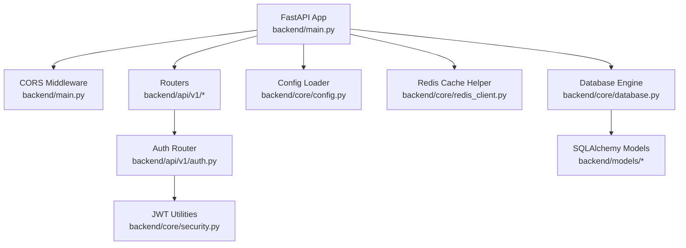
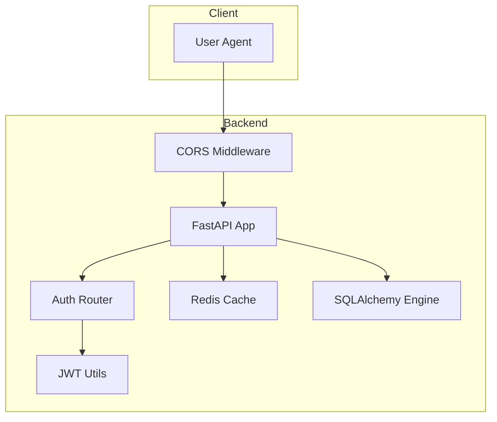
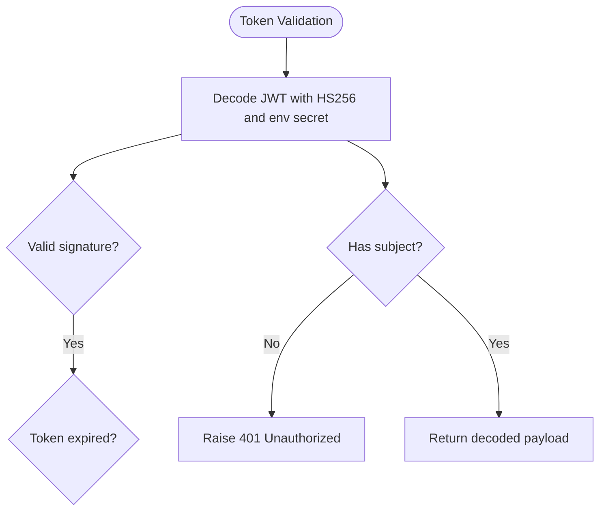
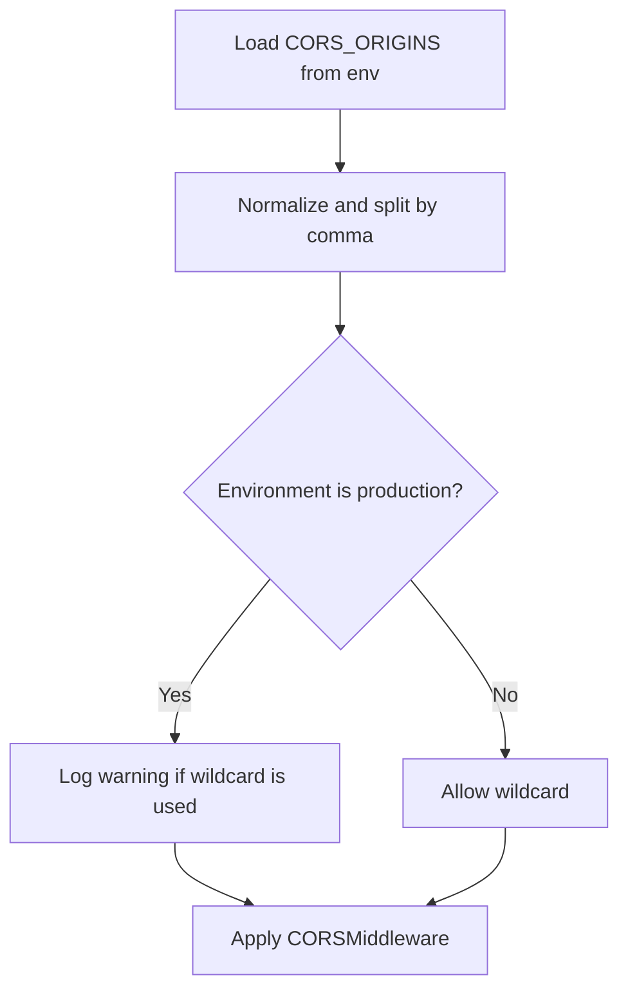
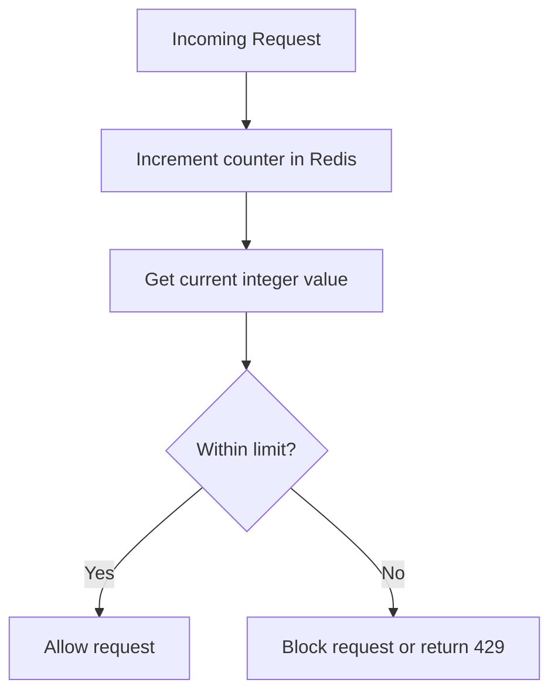
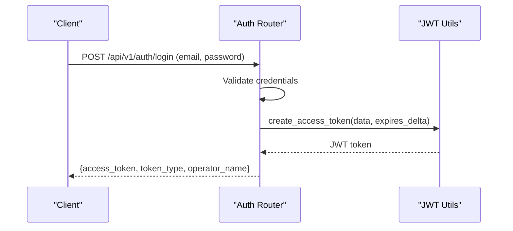
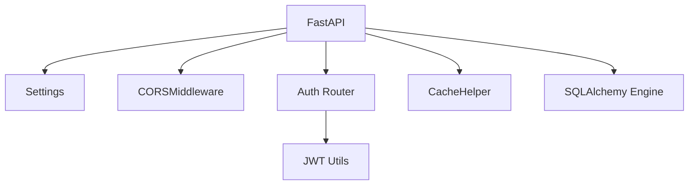

# Security and Authentication

<cite>
**Referenced Files in This Document**
- [backend/main.py](file://backend/main.py)
- [backend/core/config.py](file://backend/core/config.py)
- [backend/core/security.py](file://backend/core/security.py)
- [backend/api/v1/auth.py](file://backend/api/v1/auth.py)
- [backend/core/redis_client.py](file://backend/core/redis_client.py)
- [backend/core/database.py](file://backend/core/database.py)
- [backend/models/user.py](file://backend/models/user.py)
- [backend/models/schemas.py](file://backend/models/schemas.py)
- [.github/workflows/security.yml](file://.github/workflows/security.yml)
- [docs/Security.md](file://docs/Security.md)
- [chatbot_docs/Security.md](file://chatbot_docs/Security.md)
</cite>

## Table of Contents
1. [Introduction](#introduction)
2. [Project Structure](#project-structure)
3. [Core Components](#core-components)
4. [Architecture Overview](#architecture-overview)
5. [Detailed Component Analysis](#detailed-component-analysis)
6. [Dependency Analysis](#dependency-analysis)
7. [Performance Considerations](#performance-considerations)
8. [Troubleshooting Guide](#troubleshooting-guide)
9. [Conclusion](#conclusion)
10. [Appendices](#appendices)

## Introduction
This document provides comprehensive security documentation for SafeVixAI’s authentication and authorization systems. It explains JWT token management, CORS configuration, and rate limiting strategies. It also documents user authentication flows, session management, password security practices, API key management, OAuth integration considerations, third-party service authentication, data privacy measures, GDPR compliance considerations, secure data transmission protocols, role-based access control, permission systems, audit logging, common security vulnerabilities, penetration testing approaches, and incident response procedures. The content is designed to be accessible to beginners while offering sufficient technical depth for security professionals.

## Project Structure
SafeVixAI’s backend is a FastAPI application that integrates authentication, CORS, caching, and database connectivity. Security-relevant components include:
- Application startup and middleware registration (CORS)
- Configuration management for environment variables and CORS origins
- JWT token creation and validation utilities
- Authentication endpoint via Supabase Auth
- Redis-backed cache helper for rate limiting and session data
- SQLAlchemy async database configuration
- Pydantic models for request/response schemas and health checks

**Diagram sources**
- [backend/main.py:66-72](file://backend/main.py#L66-L72)
- [backend/api/v1/auth.py:1-44](file://backend/api/v1/auth.py#L1-L44)
- [backend/core/security.py:1-41](file://backend/core/security.py#L1-L41)
- [backend/core/config.py:73-84](file://backend/core/config.py#L73-L84)
- [backend/core/redis_client.py:10-139](file://backend/core/redis_client.py#L10-L139)
- [backend/core/database.py:21-35](file://backend/core/database.py#L21-L35)
- [backend/models/user.py:13-25](file://backend/models/user.py#L13-L25)

**Section sources**
- [backend/main.py:24-128](file://backend/main.py#L24-L128)
- [backend/core/config.py:11-181](file://backend/core/config.py#L11-L181)

## Core Components
- CORS configuration: Controlled via environment variable and applied at startup.
- JWT utilities: Token creation and validation with strict HS256 signature verification.
- Authentication endpoint: Supabase Auth login with JWT bearer token issuance.
- Redis cache helper: Provides JSON get/set/delete/increment with fallback to in-memory storage.
- Database configuration: Async SQLAlchemy engine with connection pooling and pre-ping.
- Pydantic schemas: Define request/response models and health status.

**Section sources**
- [backend/core/config.py:73-84](file://backend/core/config.py#L73-L84)
- [backend/core/security.py:13-41](file://backend/core/security.py#L13-L41)
- [backend/api/v1/auth.py:24-38](file://backend/api/v1/auth.py#L24-L38)
- [backend/core/redis_client.py:10-139](file://backend/core/redis_client.py#L10-L139)
- [backend/core/database.py:21-35](file://backend/core/database.py#L21-L35)
- [backend/models/schemas.py:15-24](file://backend/models/schemas.py#L15-L24)

## Architecture Overview
The authentication and security architecture centers around:
- CORS enforcement at the FastAPI layer
- JWT-based authentication for protected endpoints
- Supabase Auth JWT issuance with environment-sourced secrets
- Redis-backed caching for rate limiting and session data
- Database access controlled via SQLAlchemy async sessions
- Pydantic validation for all inputs

**Diagram sources**
- [backend/main.py:66-72](file://backend/main.py#L66-L72)
- [backend/api/v1/auth.py:24-38](file://backend/api/v1/auth.py#L24-L38)
- [backend/core/security.py:23-41](file://backend/core/security.py#L23-L41)
- [backend/core/redis_client.py:136-139](file://backend/core/redis_client.py#L136-L139)
- [backend/core/database.py:21-35](file://backend/core/database.py#L21-L35)

## Detailed Component Analysis

### JWT Token Management
- Token creation: Uses a symmetric HS256 algorithm with a shared secret key. Defaults to a seven-day expiration.
- Token validation: Decodes tokens using the same secret and algorithm. Includes a JWT validation using HS256 with environment-sourced secret keys.
- Payload fields: Stores subject and name fields; expiration is embedded in the token.

**Diagram sources**
- [backend/core/security.py:23-41](file://backend/core/security.py#L23-L41)

**Section sources**
- [backend/core/security.py:13-21](file://backend/core/security.py#L13-L21)
- [backend/core/security.py:23-41](file://backend/core/security.py#L23-L41)

### CORS Configuration
- Origins are loaded from an environment variable and normalized. In development, wildcards are allowed; in production, a RuntimeError is raised if wildcard CORS is used, enforcing explicit origin configuration.
- Middleware allows credentials, methods, and headers broadly.

**Diagram sources**
- [backend/core/config.py:73-84](file://backend/core/config.py#L73-L84)
- [backend/main.py:66-72](file://backend/main.py#L66-L72)

**Section sources**
- [backend/core/config.py:73-84](file://backend/core/config.py#L73-L84)
- [backend/main.py:66-72](file://backend/main.py#L66-L72)

### Rate Limiting Strategies

> **Current Implementation (Enterprise Hardened):** Rate limiting is enforced via `slowapi` decorators:
> - Chat endpoint: 5 requests/minute per IP
> - Emergency SOS endpoint: 10 requests/minute per IP
> - RoadWatch report endpoint: 8 requests/minute per IP

- Sliding window rate limiting is implemented using Redis with integer counters and TTL semantics. The cache helper supports increment and integer retrieval with Redis fallback to memory.
- Typical usage involves per-endpoint limits stored in configuration or constants.

**Diagram sources**
- [backend/core/redis_client.py:83-95](file://backend/core/redis_client.py#L83-L95)

**Section sources**
- [backend/core/redis_client.py:10-139](file://backend/core/redis_client.py#L10-L139)

### User Authentication Flows
- The login endpoint authenticates via Supabase Auth and issues a JWT bearer token.
- The demo credentials have been removed; authentication uses Supabase Auth with JWT.

**Diagram sources**
- [backend/api/v1/auth.py:24-38](file://backend/api/v1/auth.py#L24-L38)
- [backend/core/security.py:13-21](file://backend/core/security.py#L13-L21)

**Section sources**
- [backend/api/v1/auth.py:18-38](file://backend/api/v1/auth.py#L18-L38)

### Session Management
- Sessions are stateless via JWT bearer tokens. JWT tokens are validated with strict signature verification using environment-sourced keys.
- Redis cache is used for ephemeral data and counters; memory fallback ensures resilience.

**Section sources**
- [backend/core/security.py:23-41](file://backend/core/security.py#L23-L41)
- [backend/core/redis_client.py:10-139](file://backend/core/redis_client.py#L10-L139)

### Password Security Practices
- Passwords are managed by Supabase Auth with bcrypt hashing. No plaintext credentials are stored in the codebase.
- Environment variables should store secrets; credentials are sourced exclusively from environment variables.

**Section sources**
- [backend/api/v1/auth.py:26-28](file://backend/api/v1/auth.py#L26-L28)
- [docs/Security.md:108-126](file://docs/Security.md#L108-L126)

### API Key Management
- API keys are stored in environment variables and referenced in CI/CD via secrets.
- Keys are passed in headers (e.g., Authorization) rather than URLs.

**Section sources**
- [docs/Security.md:112-121](file://docs/Security.md#L112-L121)
- [.github/workflows/security.yml:39-63](file://.github/workflows/security.yml#L39-L63)

### OAuth Integration
- No OAuth integration is present in the current codebase. For production, integrate an OAuth library (e.g., Authlib or OAuth2Client) with PKCE for web apps and a redirect flow for mobile/desktop.

[No sources needed since this section provides general guidance]

### Third-Party Service Authentication
- External services are accessed using API keys passed via headers. Ensure keys are rotated regularly and scoped to minimum required permissions.

**Section sources**
- [docs/Security.md:108-126](file://docs/Security.md#L108-L126)

### Data Privacy Measures and GDPR Compliance
- Data minimization: Only collect necessary data; avoid storing GPS coordinates for emergency searches.
- Purpose limitation: Do not repurpose emergency location data for analytics.
- Storage limitation: Auto-delete chat histories after 24 hours.
- Local processing: Run offline AI inference on-device.
- User consent: Store sensitive data (blood group, contacts) only upon explicit user action.
- Transport security: Enforce HTTPS, TLS for Redis and database connections.

**Section sources**
- [docs/Security.md:64-95](file://docs/Security.md#L64-L95)
- [docs/Security.md:98-105](file://docs/Security.md#L98-L105)

### Role-Based Access Control and Permissions
- RBAC is not implemented in the current codebase. For production, define roles (e.g., operator, admin) and scopes in JWT claims, enforce via dependency overrides, and gate endpoints accordingly.

**Section sources**
- [backend/core/security.py:33-40](file://backend/core/security.py#L33-L40)

### Audit Logging
- Not implemented in the current codebase. For production, log access events (IP, user agent, endpoint, timestamp, outcome) with retention policies and secure aggregation.

[No sources needed since this section provides general guidance]

### Secure Data Transmission Protocols
- HTTPS enforced at CDN and hosting layers.
- Redis over TLS (rediss://).
- Database SSL mode enabled via connection string parameters.
- API keys transmitted in headers.

**Section sources**
- [docs/Security.md:98-105](file://docs/Security.md#L98-L105)

### Common Security Vulnerabilities
- CSRF: Mitigated by CORS and stateless JWT; ensure SameSite cookies if using cookies.
- XSS: Sanitize outputs and use Content-Security-Policy headers.
- SSRF: Restrict outbound requests to whitelisted domains.
- Insecure Deserialization: Avoid pickle; use JSON with strict schemas.
- Insecure Logging: Redact sensitive fields; avoid logging secrets.

**Section sources**
- [docs/Security.md:159-166](file://docs/Security.md#L159-L166)

### Penetration Testing Approaches
- Dynamic scanning: OWASP ZAP or Burp Suite against staging.
- Static analysis: Bandit and Safety in CI.
- Secrets scanning: Detect leaked keys in code or commits.
- Dependency checks: Dependabot and periodic audits.

**Section sources**
- [.github/workflows/security.yml:12-63](file://.github/workflows/security.yml#L12-L63)

### Incident Response Procedures
- Immediate: Isolate affected services, rotate secrets, revoke compromised tokens.
- Investigation: Collect logs, correlate timestamps, identify attack vectors.
- Remediation: Patch vulnerabilities, tighten configurations, re-validate.
- Communication: Notify impacted users per policy; document lessons learned.

[No sources needed since this section provides general guidance]

## Dependency Analysis
The authentication and security stack depends on:
- FastAPI for routing and middleware
- Pydantic for input validation
- SQLAlchemy for database access
- Redis for caching and rate limiting
- Environment variables for configuration and secrets

**Diagram sources**
- [backend/main.py:66-72](file://backend/main.py#L66-L72)
- [backend/api/v1/auth.py:24-38](file://backend/api/v1/auth.py#L24-L38)
- [backend/core/security.py:23-41](file://backend/core/security.py#L23-L41)
- [backend/core/redis_client.py:136-139](file://backend/core/redis_client.py#L136-L139)
- [backend/core/database.py:21-35](file://backend/core/database.py#L21-L35)

**Section sources**
- [backend/main.py:24-128](file://backend/main.py#L24-L128)
- [backend/core/config.py:11-181](file://backend/core/config.py#L11-L181)

## Performance Considerations
- Use Redis for hot-path rate limiting and caching to reduce database load.
- Keep token lifetimes reasonable to minimize validation overhead.
- Validate inputs early with Pydantic to fail fast and reduce downstream processing.

[No sources needed since this section provides general guidance]

## Troubleshooting Guide
- CORS errors: Verify allowed origins and credentials settings.
- JWT validation failures: Confirm secret key matches and token is not expired.
- Redis connectivity: Check URL scheme and TLS settings; confirm fallback to memory.
- Database connectivity: Ensure connection string normalization and pool settings.

**Section sources**
- [backend/core/config.py:73-84](file://backend/core/config.py#L73-L84)
- [backend/core/security.py:33-40](file://backend/core/security.py#L33-L40)
- [backend/core/redis_client.py:115-124](file://backend/core/redis_client.py#L115-L124)
- [backend/core/database.py:43-49](file://backend/core/database.py#L43-L49)

## Conclusion
SafeVixAI’s current security posture emphasizes practical protections for a hackathon MVP, including CORS enforcement, JWT-based authentication, Redis-backed caching, and strict input validation. For production, prioritize robust password hashing, RBAC, audit logging, comprehensive penetration testing, and adherence to data minimization and privacy principles. The documented CI security scanning provides a foundation for ongoing vulnerability management.

[No sources needed since this section summarizes without analyzing specific files]

## Appendices

### Appendix A: Configuration Reference
- CORS_ORIGINS: Comma-separated list of allowed origins; wildcard allowed in development, warned in production.
- ADMIN_SECRET: Header-based admin protection.
- DATABASE_URL: Normalized PostgreSQL connection string.
- REDIS_URL: Supports rediss:// for TLS.

**Section sources**
- [backend/core/config.py:16-24](file://backend/core/config.py#L16-L24)
- [backend/core/config.py:73-84](file://backend/core/config.py#L73-L84)
- [docs/Security.md:108-121](file://docs/Security.md#L108-L121)

### Appendix B: Chatbot Security Highlights
- Safety checker enforces inclusion of emergency numbers in critical responses.
- Providers isolated with dedicated SDK wrappers and fallback logic.
- Session tracking via UUID reduces persistent PII.

**Section sources**
- [chatbot_docs/Security.md:5-27](file://chatbot_docs/Security.md#L5-L27)