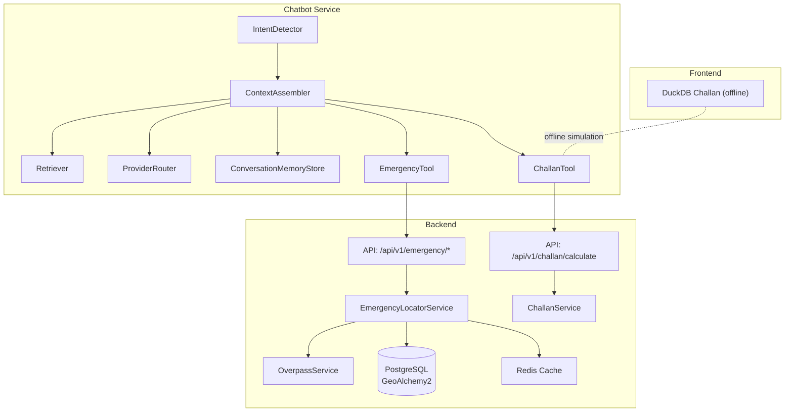
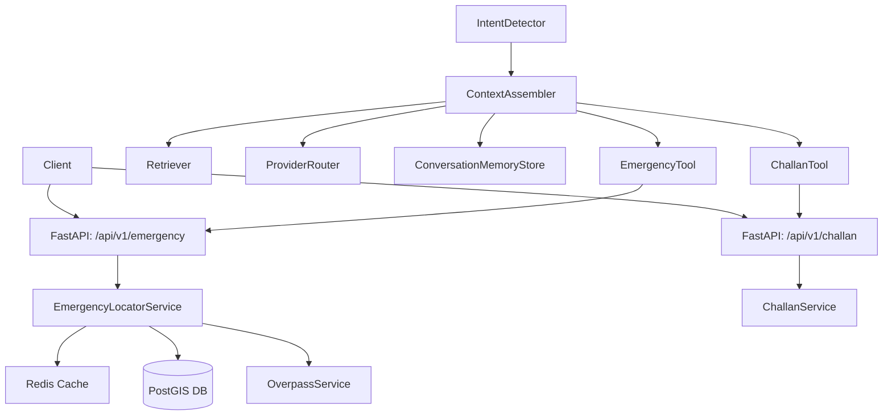
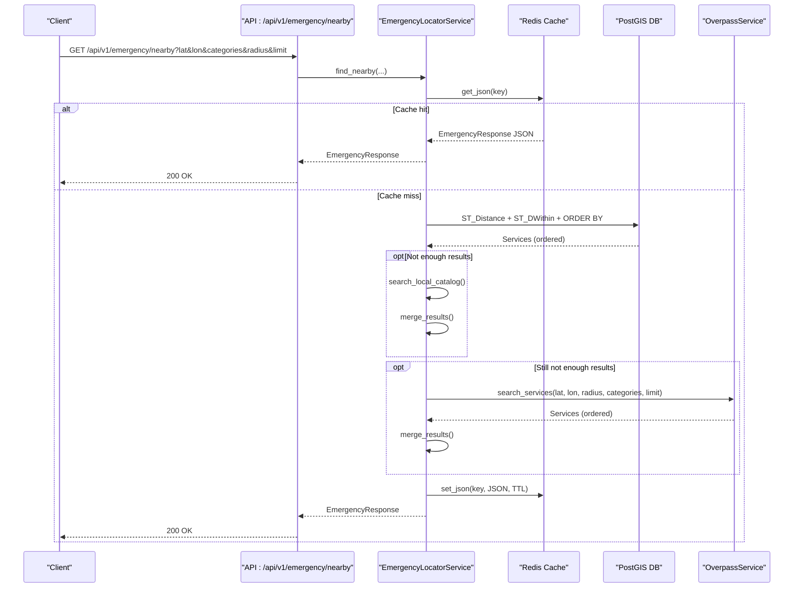
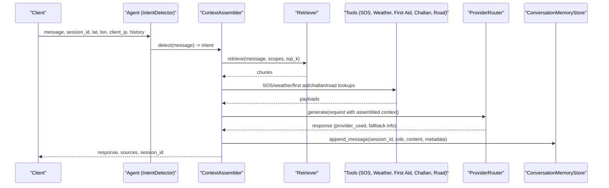
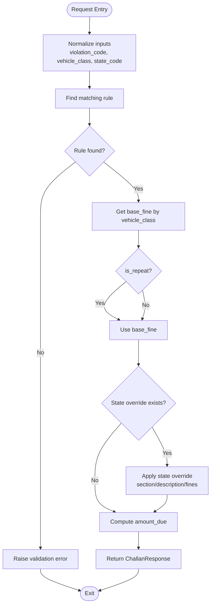
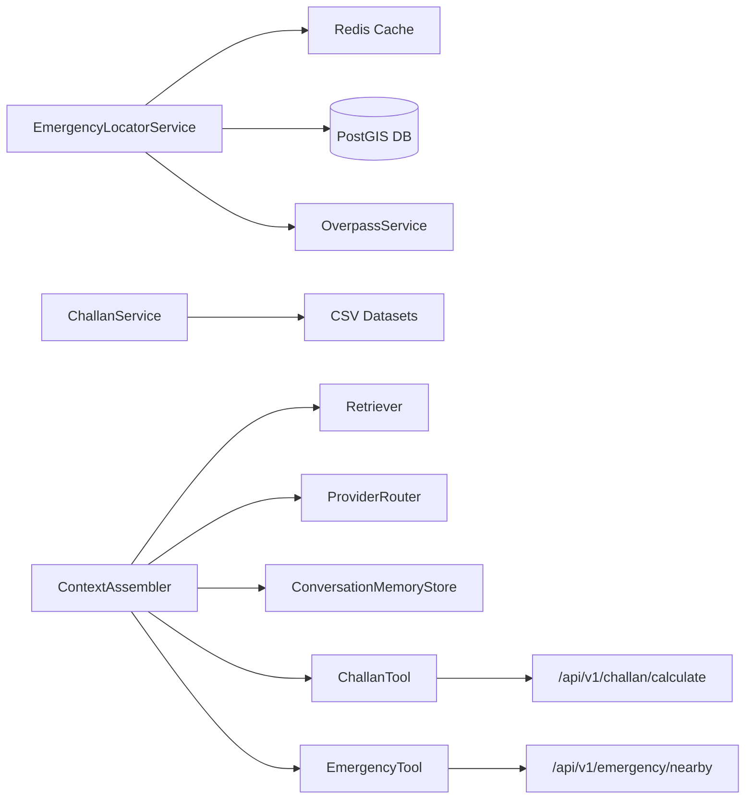

# Data Flow Patterns

<cite>
**Referenced Files in This Document**
- [emergency_locator.py](file://backend/services/emergency_locator.py)
- [overpass_service.py](file://backend/services/overpass_service.py)
- [emergency.py](file://backend/api/v1/emergency.py)
- [schemas.py](file://backend/models/schemas.py)
- [challan_service.py](file://backend/services/challan_service.py)
- [challan.py](file://backend/api/v1/challan.py)
- [duckdb-challan.ts](file://frontend/lib/duckdb-challan.ts)
- [intent_detector.py](file://chatbot_service/agent/intent_detector.py)
- [context_assembler.py](file://chatbot_service/agent/context_assembler.py)
- [state.py](file://chatbot_service/agent/state.py)
- [router.py](file://chatbot_service/providers/router.py)
- [redis_memory.py](file://chatbot_service/memory/redis_memory.py)
- [retriever.py](file://chatbot_service/rag/retriever.py)
- [challan_tool.py](file://chatbot_service/tools/challan_tool.py)
- [emergency_tool.py](file://chatbot_service/tools/emergency_tool.py)
</cite>

## Table of Contents
1. [Introduction](#introduction)
2. [Project Structure](#project-structure)
3. [Core Components](#core-components)
4. [Architecture Overview](#architecture-overview)
5. [Detailed Component Analysis](#detailed-component-analysis)
6. [Dependency Analysis](#dependency-analysis)
7. [Performance Considerations](#performance-considerations)
8. [Troubleshooting Guide](#troubleshooting-guide)
9. [Conclusion](#conclusion)

## Introduction
This document explains SafeVixAI’s data flow patterns across services, focusing on three major workflows:
- Emergency locator with cache-first strategy, PostGIS-backed database queries, and Overpass API fallback.
- AI chatbot agentic RAG pipeline: intent detection, context assembly, provider routing, and conversation memory.
- Challan calculator with DuckDB-backed offline SQL-like queries and state-specific enforcement.

It includes sequence diagrams, error handling strategies, caching policies, validation, and consistency mechanisms across distributed services.

## Project Structure
The system comprises:
- Backend API and services for emergency locator, Overpass integration, and challan calculations.
- Chatbot service for agent orchestration, retrieval-augmented generation (RAG), provider routing, and memory.
- Frontend utilities for offline challan computation.

**Diagram sources**
- [emergency.py:19-75](file://backend/api/v1/emergency.py#L19-L75)
- [challan.py:17-25](file://backend/api/v1/challan.py#L17-L25)
- [emergency_locator.py:187-373](file://backend/services/emergency_locator.py#L187-L373)
- [overpass_service.py:35-78](file://backend/services/overpass_service.py#L35-L78)
- [challan_service.py:103-149](file://backend/services/challan_service.py#L103-L149)
- [intent_detector.py:9-24](file://chatbot_service/agent/intent_detector.py#L9-L24)
- [context_assembler.py:43-81](file://chatbot_service/agent/context_assembler.py#L43-L81)
- [retriever.py:22-39](file://chatbot_service/rag/retriever.py#L22-L39)
- [router.py:154-198](file://chatbot_service/providers/router.py#L154-L198)
- [redis_memory.py:23-56](file://chatbot_service/memory/redis_memory.py#L23-L56)
- [challan_tool.py:31-69](file://chatbot_service/tools/challan_tool.py#L31-L69)
- [emergency_tool.py:10-14](file://chatbot_service/tools/emergency_tool.py#L10-L14)
- [duckdb-challan.ts:20-50](file://frontend/lib/duckdb-challan.ts#L20-L50)

**Section sources**
- [emergency_locator.py:161-373](file://backend/services/emergency_locator.py#L161-L373)
- [overpass_service.py:24-134](file://backend/services/overpass_service.py#L24-L134)
- [emergency.py:19-75](file://backend/api/v1/emergency.py#L19-L75)
- [challan_service.py:96-149](file://backend/services/challan_service.py#L96-L149)
- [challan.py:17-25](file://backend/api/v1/challan.py#L17-L25)
- [duckdb-challan.ts:20-50](file://frontend/lib/duckdb-challan.ts#L20-L50)
- [intent_detector.py:9-24](file://chatbot_service/agent/intent_detector.py#L9-L24)
- [context_assembler.py:43-81](file://chatbot_service/agent/context_assembler.py#L43-L81)
- [router.py:75-198](file://chatbot_service/providers/router.py#L75-L198)
- [redis_memory.py:10-56](file://chatbot_service/memory/redis_memory.py#L10-L56)
- [retriever.py:17-39](file://chatbot_service/rag/retriever.py#L17-L39)
- [challan_tool.py:27-69](file://chatbot_service/tools/challan_tool.py#L27-L69)
- [emergency_tool.py:6-14](file://chatbot_service/tools/emergency_tool.py#L6-L14)

## Core Components
- EmergencyLocatorService orchestrates cache-first search, PostGIS distance queries, local catalog merging, and Overpass fallback.
- OverpassService executes Overpass API queries with retry/backoff and transforms OSM data into EmergencyServiceItem.
- ChallanService loads rules and state overrides, normalizes inputs, and computes amounts with state-specific enforcement.
- Chatbot agent pipeline: IntentDetector, ContextAssembler, Retriever, ProviderRouter, ConversationMemoryStore.
- Frontend DuckDB utility simulates offline challan computation.

**Section sources**
- [emergency_locator.py:161-373](file://backend/services/emergency_locator.py#L161-L373)
- [overpass_service.py:24-134](file://backend/services/overpass_service.py#L24-L134)
- [challan_service.py:96-149](file://backend/services/challan_service.py#L96-L149)
- [intent_detector.py:9-24](file://chatbot_service/agent/intent_detector.py#L9-L24)
- [context_assembler.py:17-81](file://chatbot_service/agent/context_assembler.py#L17-L81)
- [router.py:75-198](file://chatbot_service/providers/router.py#L75-L198)
- [redis_memory.py:10-56](file://chatbot_service/memory/redis_memory.py#L10-L56)
- [duckdb-challan.ts:20-50](file://frontend/lib/duckdb-challan.ts#L20-L50)

## Architecture Overview
The system integrates backend APIs, caching, external services, and a chatbot agent with RAG and provider routing.

**Diagram sources**
- [emergency.py:19-75](file://backend/api/v1/emergency.py#L19-L75)
- [challan.py:17-25](file://backend/api/v1/challan.py#L17-L25)
- [emergency_locator.py:187-373](file://backend/services/emergency_locator.py#L187-L373)
- [overpass_service.py:35-78](file://backend/services/overpass_service.py#L35-L78)
- [challan_service.py:103-149](file://backend/services/challan_service.py#L103-L149)
- [intent_detector.py:9-24](file://chatbot_service/agent/intent_detector.py#L9-L24)
- [context_assembler.py:43-81](file://chatbot_service/agent/context_assembler.py#L43-L81)
- [router.py:154-198](file://chatbot_service/providers/router.py#L154-L198)
- [redis_memory.py:23-56](file://chatbot_service/memory/redis_memory.py#L23-L56)
- [challan_tool.py:31-69](file://chatbot_service/tools/challan_tool.py#L31-L69)
- [emergency_tool.py:10-14](file://chatbot_service/tools/emergency_tool.py#L10-L14)

## Detailed Component Analysis

### Emergency Locator Data Flow (Cache-first, PostGIS, Overpass Fallback)
This workflow implements a robust cache-first strategy, falls back to local catalog, and finally queries Overpass when needed.

**Diagram sources**
- [emergency.py:19-39](file://backend/api/v1/emergency.py#L19-L39)
- [emergency_locator.py:187-373](file://backend/services/emergency_locator.py#L187-L373)
- [overpass_service.py:35-78](file://backend/services/overpass_service.py#L35-L78)
- [schemas.py:53-58](file://backend/models/schemas.py#L53-L58)

Key behaviors:
- Cache key includes coordinates, categories, radius, and limit.
- PostGIS query uses geography type and distance ordering; supports trauma/24hr prioritization.
- Local catalog and Overpass results are merged to avoid duplicates and capped at limit.
- Overpass fallback is attempted with retries and backoff; errors are handled gracefully.

**Section sources**
- [emergency_locator.py:187-373](file://backend/services/emergency_locator.py#L187-L373)
- [overpass_service.py:35-134](file://backend/services/overpass_service.py#L35-L134)
- [emergency.py:19-39](file://backend/api/v1/emergency.py#L19-L39)
- [schemas.py:36-58](file://backend/models/schemas.py#L36-L58)

### AI Chatbot Agentic RAG Data Flow (Intent Detection, Context Assembly, Provider Routing, Memory)
The chatbot pipeline detects intent, assembles context from tools and RAG, selects a provider, and manages conversation memory.

**Diagram sources**
- [intent_detector.py:9-24](file://chatbot_service/agent/intent_detector.py#L9-L24)
- [context_assembler.py:43-81](file://chatbot_service/agent/context_assembler.py#L43-L81)
- [retriever.py:22-39](file://chatbot_service/rag/retriever.py#L22-L39)
- [router.py:154-198](file://chatbot_service/providers/router.py#L154-L198)
- [redis_memory.py:23-56](file://chatbot_service/memory/redis_memory.py#L23-L56)
- [state.py:41-52](file://chatbot_service/agent/state.py#L41-L52)
- [challan_tool.py:49-69](file://chatbot_service/tools/challan_tool.py#L49-L69)
- [emergency_tool.py:10-14](file://chatbot_service/tools/emergency_tool.py#L10-L14)

Processing logic highlights:
- IntentDetector classifies messages into emergency, first aid, challan, legal, road_issue, or general.
- ContextAssembler builds ConversationContext with retrieved chunks and tool payloads, enriching with SOS, weather, first aid, and road data.
- ProviderRouter auto-selects providers based on language and intent, with a strict fallback chain.
- ConversationMemoryStore persists and retrieves session histories with Redis and in-memory fallback.

**Section sources**
- [intent_detector.py:9-24](file://chatbot_service/agent/intent_detector.py#L9-L24)
- [context_assembler.py:43-215](file://chatbot_service/agent/context_assembler.py#L43-L215)
- [retriever.py:17-40](file://chatbot_service/rag/retriever.py#L17-L40)
- [router.py:75-198](file://chatbot_service/providers/router.py#L75-L198)
- [redis_memory.py:10-90](file://chatbot_service/memory/redis_memory.py#L10-L90)
- [state.py:24-52](file://chatbot_service/agent/state.py#L24-L52)
- [challan_tool.py:27-81](file://chatbot_service/tools/challan_tool.py#L27-L81)
- [emergency_tool.py:6-15](file://chatbot_service/tools/emergency_tool.py#L6-L15)

### Challan Calculator Data Flow (DuckDB SQL-like Queries and State Overrides)
The challan calculator validates inputs, applies state-specific overrides, and computes amounts. The frontend provides an offline DuckDB simulation.

**Diagram sources**
- [challan_service.py:103-149](file://backend/services/challan_service.py#L103-L149)
- [challan.py:17-25](file://backend/api/v1/challan.py#L17-L25)
- [schemas.py:240-257](file://backend/models/schemas.py#L240-L257)
- [duckdb-challan.ts:20-50](file://frontend/lib/duckdb-challan.ts#L20-L50)

Validation and normalization:
- Vehicle class and state code are normalized; unknown state defaults are enforced.
- CSV loading for rules and state overrides supports flexible column mappings.
- Money parsing extracts numeric values from strings.

Frontend offline simulation:
- DuckDB Challan utility simulates offline computation and returns base/repeat fines and section info.

**Section sources**
- [challan_service.py:96-314](file://backend/services/challan_service.py#L96-L314)
- [challan.py:17-25](file://backend/api/v1/challan.py#L17-L25)
- [schemas.py:240-257](file://backend/models/schemas.py#L240-L257)
- [duckdb-challan.ts:20-50](file://frontend/lib/duckdb-challan.ts#L20-L50)

## Dependency Analysis
- EmergencyLocatorService depends on Redis cache, PostGIS via SQLAlchemy/GeoAlchemy2, OverpassService, and local catalog loader.
- OverpassService encapsulates HTTP client, timeouts, and retry/backoff for multiple upstream endpoints.
- ChallanService loads optional datasets from multiple locations and merges defaults with overrides.
- Chatbot components depend on Retriever, tools, ProviderRouter, and ConversationMemoryStore.
- Frontend DuckDB utility is decoupled from backend but aligns with backend schema for offline parity.

**Diagram sources**
- [emergency_locator.py:161-373](file://backend/services/emergency_locator.py#L161-L373)
- [overpass_service.py:24-134](file://backend/services/overpass_service.py#L24-L134)
- [challan_service.py:151-238](file://backend/services/challan_service.py#L151-L238)
- [context_assembler.py:17-41](file://chatbot_service/agent/context_assembler.py#L17-L41)
- [router.py:75-109](file://chatbot_service/providers/router.py#L75-L109)
- [redis_memory.py:10-21](file://chatbot_service/memory/redis_memory.py#L10-L21)
- [challan_tool.py:27-47](file://chatbot_service/tools/challan_tool.py#L27-L47)
- [emergency_tool.py:6-14](file://chatbot_service/tools/emergency_tool.py#L6-L14)
- [challan.py:17-25](file://backend/api/v1/challan.py#L17-L25)
- [emergency.py:19-39](file://backend/api/v1/emergency.py#L19-L39)

**Section sources**
- [emergency_locator.py:161-373](file://backend/services/emergency_locator.py#L161-L373)
- [overpass_service.py:24-134](file://backend/services/overpass_service.py#L24-L134)
- [challan_service.py:151-238](file://backend/services/challan_service.py#L151-L238)
- [context_assembler.py:17-41](file://chatbot_service/agent/context_assembler.py#L17-L41)
- [router.py:75-109](file://chatbot_service/providers/router.py#L75-L109)
- [redis_memory.py:10-21](file://chatbot_service/memory/redis_memory.py#L10-L21)
- [challan_tool.py:27-47](file://chatbot_service/tools/challan_tool.py#L27-L47)
- [emergency_tool.py:6-14](file://chatbot_service/tools/emergency_tool.py#L6-L14)
- [challan.py:17-25](file://backend/api/v1/challan.py#L17-L25)
- [emergency.py:19-39](file://backend/api/v1/emergency.py#L19-L39)

## Performance Considerations
- Emergency locator:
  - Cache-first reduces DB and external API calls; TTL balances freshness vs. latency.
  - PostGIS geography indexing and distance ordering minimize scan cost.
  - Overpass queries are bounded by radius and sorted by relevance.
- Chatbot:
  - ProviderRouter’s fallback chain ensures resilience; language detection avoids expensive translation.
  - ConversationMemoryStore uses Redis lists with expiration; in-memory fallback prevents outages.
- Challan:
  - CSV loading is performed once during initialization; repeated queries are O(1) lookups.
  - Frontend DuckDB simulation provides instant offline results.

[No sources needed since this section provides general guidance]

## Troubleshooting Guide
- Emergency locator:
  - ExternalServiceError from Overpass is caught and handled; if no database results, the API returns HTTP 503.
  - Cache failures fall back to synchronous computation; verify Redis connectivity and TTL.
- Chatbot:
  - ProviderRouter raises runtime error after exhausting fallbacks; monitor provider health and quotas.
  - ConversationMemoryStore toggles between Redis and in-memory modes; ping indicates health.
- Challan:
  - ServiceValidationError for unsupported violation codes or missing required fields; validate inputs and state normalization.
  - CSV parsing errors are ignored to keep defaults intact; verify dataset presence and encoding.

**Section sources**
- [emergency.py:38-70](file://backend/api/v1/emergency.py#L38-L70)
- [emergency_locator.py:343-364](file://backend/services/emergency_locator.py#L343-L364)
- [router.py:196-198](file://chatbot_service/providers/router.py#L196-L198)
- [redis_memory.py:67-76](file://chatbot_service/memory/redis_memory.py#L67-L76)
- [challan_service.py:110-113](file://backend/services/challan_service.py#L110-L113)

## Conclusion
SafeVixAI’s data flows emphasize reliability and responsiveness:
- Emergency locator combines caching, spatial queries, and external fallbacks.
- Chatbot agent integrates intent detection, RAG, provider routing, and memory for coherent, multilingual experiences.
- Challan calculator enforces state-specific rules with robust normalization and validation.
These patterns ensure consistent behavior across services and graceful degradation under failure conditions.