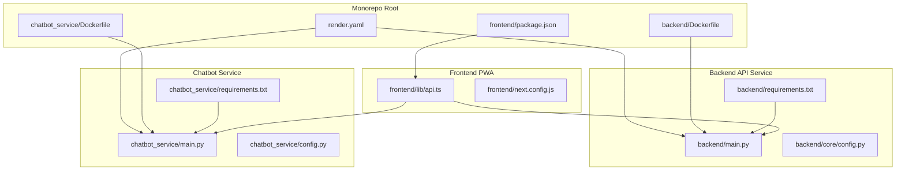
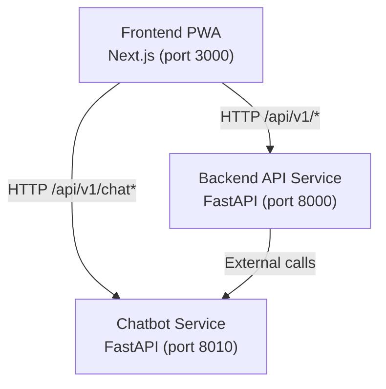
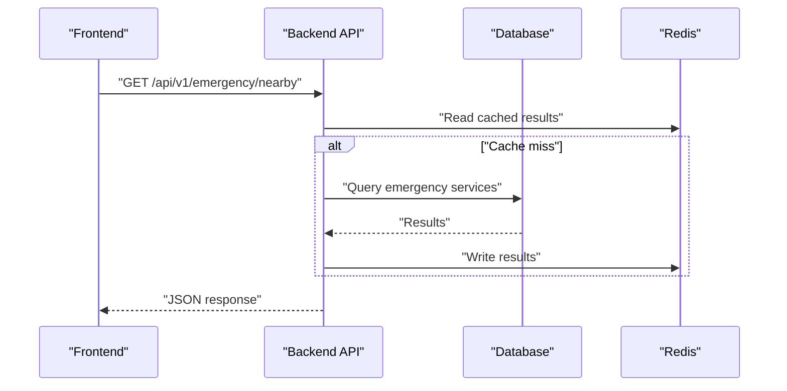
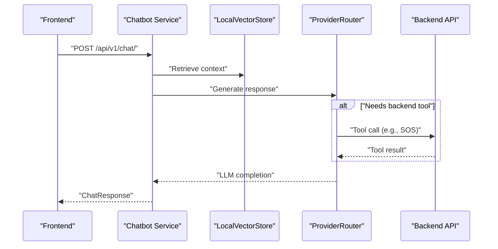
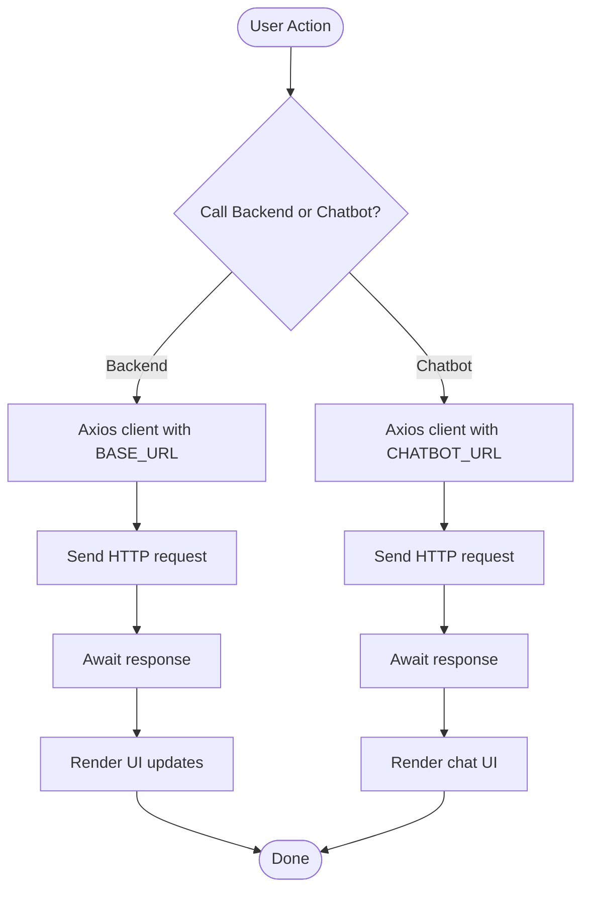
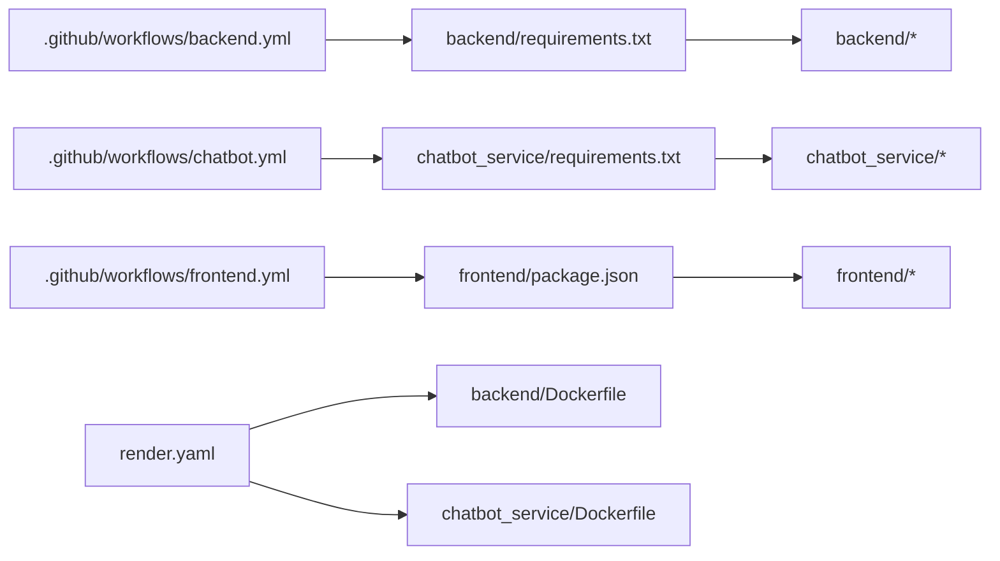

# Microservices Architecture

<cite>
**Referenced Files in This Document**
- [render.yaml](file://render.yaml)
- [backend/Dockerfile](file://backend/Dockerfile)
- [chatbot_service/Dockerfile](file://chatbot_service/Dockerfile)
- [backend/main.py](file://backend/main.py)
- [chatbot_service/main.py](file://chatbot_service/main.py)
- [backend/core/config.py](file://backend/core/config.py)
- [chatbot_service/config.py](file://chatbot_service/config.py)
- [frontend/lib/api.ts](file://frontend/lib/api.ts)
- [frontend/next.config.js](file://frontend/next.config.js)
- [frontend/package.json](file://frontend/package.json)
- [.github/workflows/backend.yml](file://.github/workflows/backend.yml)
- [.github/workflows/chatbot.yml](file://.github/workflows/chatbot.yml)
- [.github/workflows/frontend.yml](file://.github/workflows/frontend.yml)
- [backend/requirements.txt](file://backend/requirements.txt)
- [chatbot_service/requirements.txt](file://chatbot_service/requirements.txt)
</cite>

## Table of Contents
1. [Introduction](#introduction)
2. [Project Structure](#project-structure)
3. [Core Components](#core-components)
4. [Architecture Overview](#architecture-overview)
5. [Detailed Component Analysis](#detailed-component-analysis)
6. [Dependency Analysis](#dependency-analysis)
7. [Performance Considerations](#performance-considerations)
8. [Troubleshooting Guide](#troubleshooting-guide)
9. [Conclusion](#conclusion)
10. [Appendices](#appendices)

## Introduction
This document describes the microservices architecture of SafeVixAI, focusing on the separation of concerns across three independently deployable services:
- Backend API service (port 8000)
- Chatbot service (port 8010)
- Frontend PWA (port 3000)

It explains independent deployment strategies, separate virtual environments, distinct Docker configurations, service boundaries, inter-service communication patterns, and API gateway considerations. It also documents the deployment topology across Render.com and Vercel, and how the monorepo structure supports independent requirements.txt, environment variables, and configuration per service.

## Project Structure
SafeVixAI follows a monorepo layout with three primary service folders:
- backend/: FastAPI-based backend API service
- chatbot_service/: Agentic RAG-powered chatbot service
- frontend/: Next.js PWA frontend

Each service maintains its own:
- Dockerfile for containerization
- requirements.txt for Python dependencies
- environment configuration (dotenv and runtime env vars)
- GitHub Actions workflows for CI

**Diagram sources**
- [render.yaml:1-83](file://render.yaml#L1-L83)
- [backend/Dockerfile:1-27](file://backend/Dockerfile#L1-L27)
- [chatbot_service/Dockerfile:1-52](file://chatbot_service/Dockerfile#L1-L52)
- [backend/main.py:1-132](file://backend/main.py#L1-L132)
- [chatbot_service/main.py:1-149](file://chatbot_service/main.py#L1-L149)
- [backend/core/config.py:1-181](file://backend/core/config.py#L1-L181)
- [chatbot_service/config.py:1-126](file://chatbot_service/config.py#L1-L126)
- [frontend/lib/api.ts:1-821](file://frontend/lib/api.ts#L1-L821)
- [frontend/next.config.js:1-44](file://frontend/next.config.js#L1-L44)
- [frontend/package.json:1-85](file://frontend/package.json#L1-L85)
- [backend/requirements.txt:1-49](file://backend/requirements.txt#L1-L49)
- [chatbot_service/requirements.txt:1-53](file://chatbot_service/requirements.txt#L1-L53)

**Section sources**
- [render.yaml:1-83](file://render.yaml#L1-L83)
- [backend/Dockerfile:1-27](file://backend/Dockerfile#L1-L27)
- [chatbot_service/Dockerfile:1-52](file://chatbot_service/Dockerfile#L1-L52)
- [backend/main.py:1-132](file://backend/main.py#L1-L132)
- [chatbot_service/main.py:1-149](file://chatbot_service/main.py#L1-L149)
- [backend/core/config.py:1-181](file://backend/core/config.py#L1-L181)
- [chatbot_service/config.py:1-126](file://chatbot_service/config.py#L1-L126)
- [frontend/lib/api.ts:1-821](file://frontend/lib/api.ts#L1-L821)
- [frontend/next.config.js:1-44](file://frontend/next.config.js#L1-L44)
- [frontend/package.json:1-85](file://frontend/package.json#L1-L85)
- [backend/requirements.txt:1-49](file://backend/requirements.txt#L1-L49)
- [chatbot_service/requirements.txt:1-53](file://chatbot_service/requirements.txt#L1-L53)

## Core Components
- Backend API service (FastAPI):
  - Exposes REST endpoints under /api/v1
  - Manages database, Redis cache, and integrates external services
  - Defines health endpoint and static uploads serving
- Chatbot service (FastAPI):
  - Provides agentic RAG chat and streaming endpoints
  - Integrates multiple LLM providers and manages conversational memory
  - Includes rate limiting and admin endpoints
- Frontend PWA (Next.js):
  - Communicates with backend API and chatbot service via separate clients
  - Configured for WASM and Web Worker support for offline AI features
  - Uses environment variables for base URLs and auth tokens

Key runtime characteristics:
- Backend listens on port 8000
- Chatbot listens on port 8010
- Frontend runs development server on port 3000 locally

**Section sources**
- [backend/main.py:24-132](file://backend/main.py#L24-L132)
- [chatbot_service/main.py:41-149](file://chatbot_service/main.py#L41-L149)
- [backend/core/config.py:50-64](file://backend/core/config.py#L50-L64)
- [chatbot_service/config.py:72-84](file://chatbot_service/config.py#L72-L84)
- [frontend/lib/api.ts:4-47](file://frontend/lib/api.ts#L4-L47)
- [frontend/next.config.js:19-40](file://frontend/next.config.js#L19-L40)

## Architecture Overview
SafeVixAI employs a clear microservices boundary:
- Backend API service centralizes data access, business logic, and integrations
- Chatbot service encapsulates conversational AI, RAG, and provider orchestration
- Frontend PWA consumes both services via distinct HTTP clients

Inter-service communication:
- Frontend communicates with backend API at http://localhost:8000 (or configured base URL)
- Frontend communicates with chatbot service at http://localhost:8010 (or configured base URL)
- Backend optionally delegates chat-related requests to chatbot service when configured

**Diagram sources**
- [frontend/lib/api.ts:4-47](file://frontend/lib/api.ts#L4-L47)
- [backend/main.py:98-99](file://backend/main.py#L98-L99)
- [chatbot_service/main.py:130-137](file://chatbot_service/main.py#L130-L137)

**Section sources**
- [frontend/lib/api.ts:4-47](file://frontend/lib/api.ts#L4-L47)
- [backend/main.py:98-99](file://backend/main.py#L98-L99)
- [chatbot_service/main.py:130-137](file://chatbot_service/main.py#L130-L137)

## Detailed Component Analysis

### Backend API Service
Responsibilities:
- REST API surface under /api/v1
- Health checks and static file serving
- Integration with database, Redis, geocoding, routing, and emergency services
- Optional delegation to chatbot service for chat-related features

Configuration and lifecycle:
- Reads environment variables via pydantic settings
- Initializes shared services during lifespan
- Exposes health endpoint for Render readiness/liveness

**Diagram sources**
- [backend/main.py:88-127](file://backend/main.py#L88-L127)
- [backend/core/config.py:11-70](file://backend/core/config.py#L11-L70)

**Section sources**
- [backend/main.py:24-132](file://backend/main.py#L24-L132)
- [backend/core/config.py:11-181](file://backend/core/config.py#L11-L181)

### Chatbot Service
Responsibilities:
- Agentic RAG chat engine with intent detection and safety checks
- Multi-provider LLM routing and fallback
- Conversational memory backed by Redis
- Admin endpoints for index rebuilding

Configuration and lifecycle:
- Loads environment variables from .env and runtime env vars
- Initializes vector store, retriever, tools, and provider router
- Exposes health and chat endpoints

**Diagram sources**
- [chatbot_service/main.py:71-83](file://chatbot_service/main.py#L71-L83)
- [chatbot_service/config.py:71-113](file://chatbot_service/config.py#L71-L113)

**Section sources**
- [chatbot_service/main.py:41-149](file://chatbot_service/main.py#L41-L149)
- [chatbot_service/config.py:39-126](file://chatbot_service/config.py#L39-L126)

### Frontend PWA
Responsibilities:
- Renders UI and orchestrates calls to backend and chatbot
- Configures Axios clients with base URLs and interceptors
- Enables WASM and Web Workers for offline AI features

Communication pattern:
- Two Axios clients: one for backend API, one for chatbot service
- Environment variables drive base URLs and auth tokens
- Remote image patterns configured for maps and assets

**Diagram sources**
- [frontend/lib/api.ts:4-47](file://frontend/lib/api.ts#L4-L47)

**Section sources**
- [frontend/lib/api.ts:1-821](file://frontend/lib/api.ts#L1-L821)
- [frontend/next.config.js:1-44](file://frontend/next.config.js#L1-L44)
- [frontend/package.json:1-85](file://frontend/package.json#L1-L85)

## Dependency Analysis
Independent deployments and environments:
- Render.com deployment configuration defines two web services:
  - safevixai-backend (rootDir: backend)
  - safevixai-chatbot (rootDir: chatbot_service)
- Each service has dedicated Dockerfiles and start commands
- Separate requirements.txt files define service-specific dependencies
- GitHub Actions workflows run isolated tests per service

**Diagram sources**
- [.github/workflows/backend.yml:1-55](file://.github/workflows/backend.yml#L1-L55)
- [.github/workflows/chatbot.yml:1-55](file://.github/workflows/chatbot.yml#L1-L55)
- [.github/workflows/frontend.yml:1-43](file://.github/workflows/frontend.yml#L1-L43)
- [render.yaml:1-83](file://render.yaml#L1-L83)
- [backend/requirements.txt:1-49](file://backend/requirements.txt#L1-L49)
- [chatbot_service/requirements.txt:1-53](file://chatbot_service/requirements.txt#L1-L53)
- [backend/Dockerfile:1-27](file://backend/Dockerfile#L1-L27)
- [chatbot_service/Dockerfile:1-52](file://chatbot_service/Dockerfile#L1-L52)
- [frontend/package.json:1-85](file://frontend/package.json#L1-L85)

**Section sources**
- [render.yaml:1-83](file://render.yaml#L1-L83)
- [.github/workflows/backend.yml:1-55](file://.github/workflows/backend.yml#L1-L55)
- [.github/workflows/chatbot.yml:1-55](file://.github/workflows/chatbot.yml#L1-L55)
- [.github/workflows/frontend.yml:1-43](file://.github/workflows/frontend.yml#L1-L43)
- [backend/requirements.txt:1-49](file://backend/requirements.txt#L1-L49)
- [chatbot_service/requirements.txt:1-53](file://chatbot_service/requirements.txt#L1-L53)
- [backend/Dockerfile:1-27](file://backend/Dockerfile#L1-L27)
- [chatbot_service/Dockerfile:1-52](file://chatbot_service/Dockerfile#L1-L52)
- [frontend/package.json:1-85](file://frontend/package.json#L1-L85)

## Performance Considerations
- Separate Docker containers enable independent scaling of backend and chatbot services
- Chatbot service includes a health check and rate limiting to protect resources
- Frontend is configured for WASM and Web Workers to support offline AI without blocking the main thread
- Backend leverages Redis caching for frequently accessed emergency and routing data
- Environment-driven timeouts and provider fallbacks improve resilience

[No sources needed since this section provides general guidance]

## Troubleshooting Guide
Common issues and diagnostics:
- Backend health failures:
  - Verify database connectivity and Redis availability
  - Check environment variables for DATABASE_URL, REDIS_URL, and CORS_ORIGINS
- Chatbot health failures:
  - Confirm memory backend availability and vector store initialization
  - Ensure at least one LLM provider API key is configured
- Frontend communication errors:
  - Validate NEXT_PUBLIC_API_URL and NEXT_PUBLIC_CHATBOT_URL
  - Confirm Authorization header injection and token persistence
- Render deployment issues:
  - Ensure rootDir matches service folder in render.yaml
  - Confirm PORT variable usage and startCommand alignment with exposed ports

**Section sources**
- [backend/main.py:103-125](file://backend/main.py#L103-L125)
- [chatbot_service/main.py:106-115](file://chatbot_service/main.py#L106-L115)
- [chatbot_service/config.py:118-126](file://chatbot_service/config.py#L118-L126)
- [frontend/lib/api.ts:4-47](file://frontend/lib/api.ts#L4-L47)
- [render.yaml:1-83](file://render.yaml#L1-L83)

## Conclusion
SafeVixAI’s microservices architecture cleanly separates concerns across backend API, chatbot, and frontend PWA. Independent deployments on Render.com and Vercel, combined with distinct Docker configurations and environment settings, enable scalable and maintainable operations. Inter-service communication is explicit and decoupled, with the frontend consuming both services via separate HTTP clients. The monorepo structure preserves independence while sharing common documentation and CI/CD patterns.

[No sources needed since this section summarizes without analyzing specific files]

## Appendices

### Deployment Topology and API Gateway Considerations
- Render.com:
  - Two web services defined with separate rootDir and start commands
  - Environment variables injected per service for secrets and URLs
- Vercel:
  - Frontend PWA is configured for static hosting and environment-driven base URLs
- API gateway:
  - Current setup uses direct service-to-service calls
  - An API gateway could consolidate routing, authentication, and rate limiting if traffic grows

**Section sources**
- [render.yaml:1-83](file://render.yaml#L1-L83)
- [frontend/lib/api.ts:4-47](file://frontend/lib/api.ts#L4-L47)