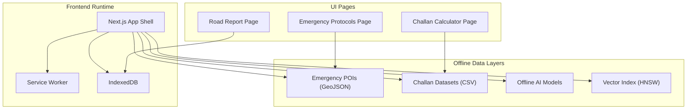
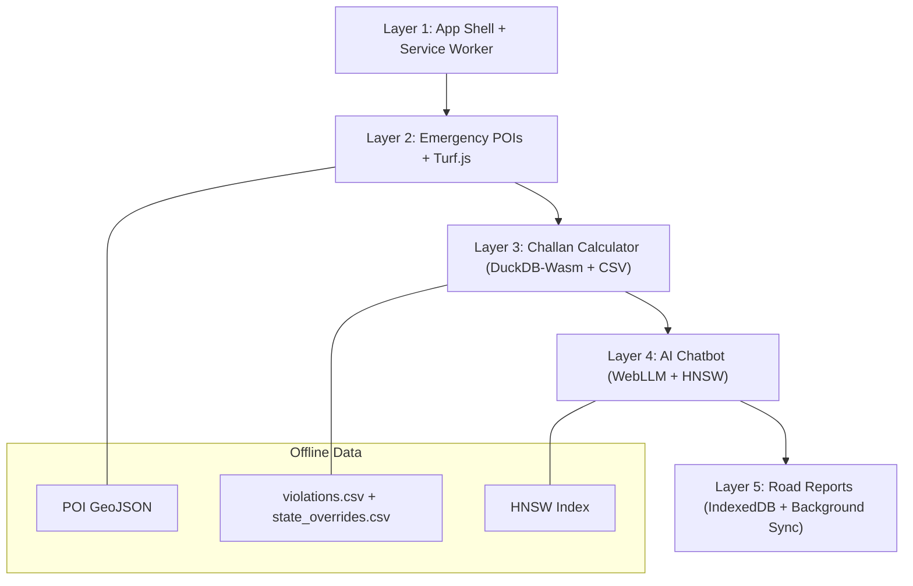
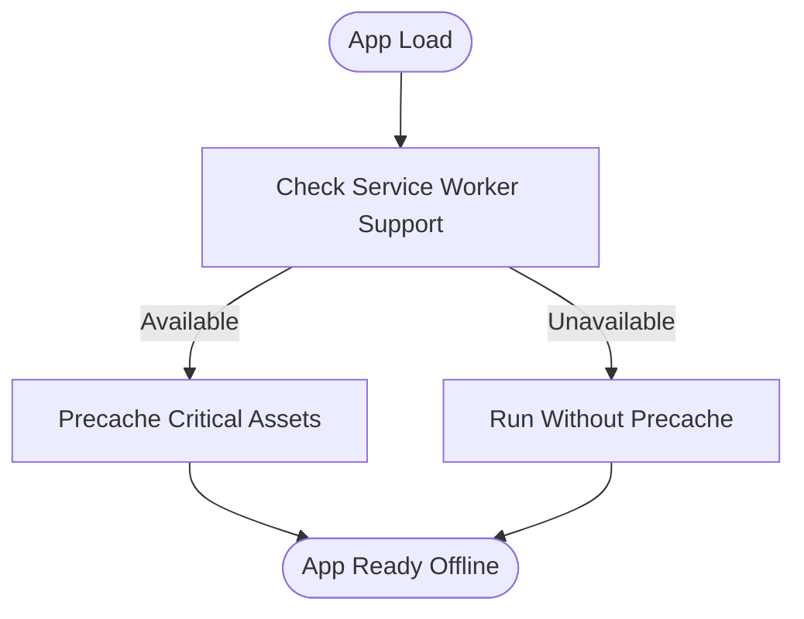
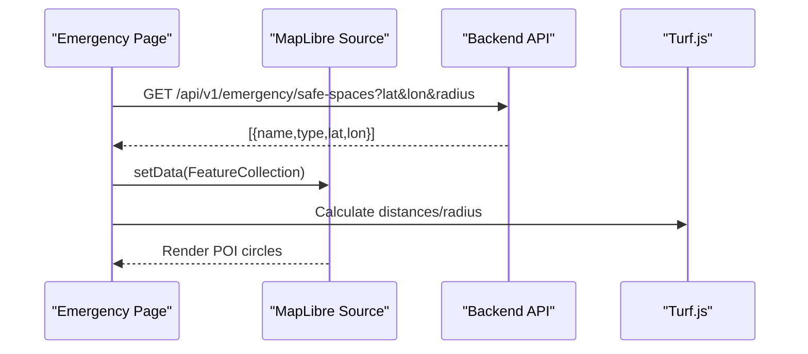
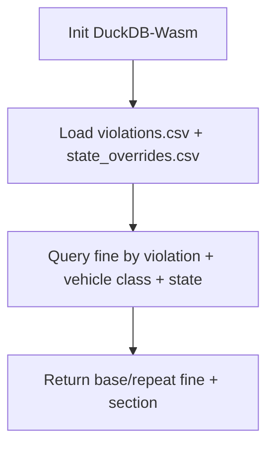
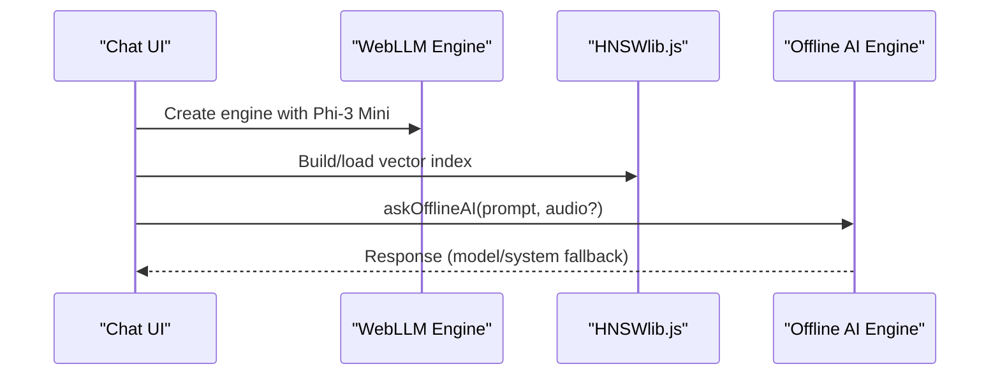
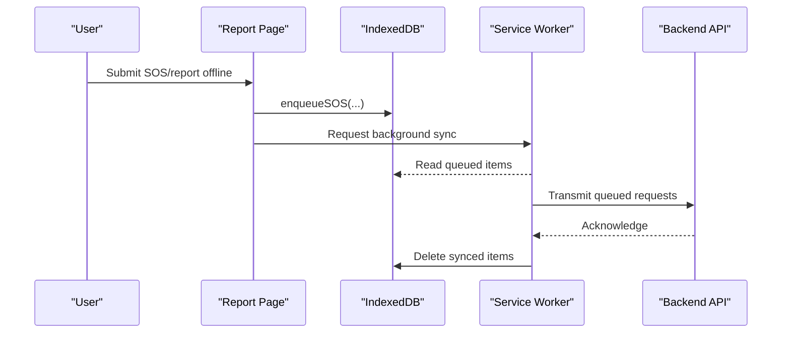
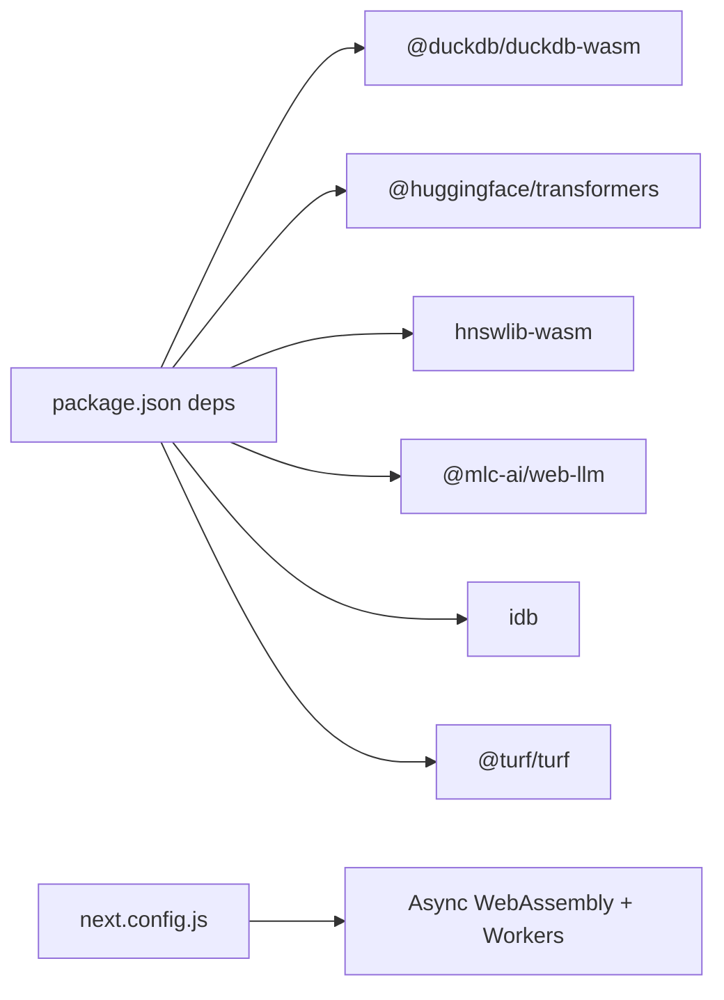

# Offline Architecture

<cite>
**Referenced Files in This Document**
- [Offline_Architecture.md](file://docs/Offline_Architecture.md)
- [offline-ai.ts](file://frontend/lib/offline-ai.ts)
- [offline-rag.ts](file://frontend/lib/offline-rag.ts)
- [duckdb-challan.ts](file://frontend/lib/duckdb-challan.ts)
- [violations.csv](file://frontend/public/offline-data/violations.csv)
- [state_overrides.csv](file://frontend/public/offline-data/state_overrides.csv)
- [offline-sos-queue.ts](file://frontend/lib/offline-sos-queue.ts)
- [next.config.js](file://frontend/next.config.js)
- [package.json](file://frontend/package.json)
- [OfflineChat.tsx](file://frontend/components/OfflineChat.tsx)
- [page.tsx (Emergency)](file://frontend/app/emergency/page.tsx)
- [page.tsx (Challan)](file://frontend/app/challan/page.tsx)
- [page.tsx (Report)](file://frontend/app/report/page.tsx)
- [emergency-numbers.ts](file://frontend/lib/emergency-numbers.ts)
</cite>

## Table of Contents
1. [Introduction](#introduction)
2. [Project Structure](#project-structure)
3. [Core Components](#core-components)
4. [Architecture Overview](#architecture-overview)
5. [Detailed Component Analysis](#detailed-component-analysis)
6. [Dependency Analysis](#dependency-analysis)
7. [Performance Considerations](#performance-considerations)
8. [Troubleshooting Guide](#troubleshooting-guide)
9. [Conclusion](#conclusion)
10. [Appendices](#appendices)

## Introduction
This document explains SafeVixAI’s five-layer offline-first architecture designed to remain fully functional in disconnected environments. It covers:
- Layer 1: App shell with service worker precache
- Layer 2: Emergency POI data with GeoJSON and Turf.js
- Layer 3: Challan calculator backed by DuckDB-Wasm and cached CSV datasets
- Layer 4: AI chatbot with WebLLM Phi-3 Mini and HNSWlib.js
- Layer 5: Road reports with IndexedDB and background sync

We also describe progressive enhancement, service worker integration, IndexedDB storage strategies, offline AI capabilities, vector search approaches, and performance considerations for offline scenarios.

## Project Structure
SafeVixAI’s frontend is a Next.js application with offline-focused libraries and data bundles. The offline architecture spans:
- Frontend runtime and build configuration enabling WebAssembly and Web Workers
- Local data assets for emergency numbers, challan datasets, and offline AI models
- IndexedDB-backed offline queues for SOS events
- UI pages orchestrating offline experiences for emergency protocols, challan estimation, and road reporting

**Section sources**
- [next.config.js:19-40](file://frontend/next.config.js#L19-L40)
- [package.json:14-52](file://frontend/package.json#L14-L52)

## Core Components
- App shell and service worker precache: Ensures critical assets are cached for offline readiness.
- Emergency POI rendering: Uses GeoJSON sources and Turf.js for proximity and spatial operations.
- Challan calculator: Leverages DuckDB-Wasm and cached CSV datasets for offline calculations.
- AI chatbot: Integrates WebLLM Phi-3 Mini with HNSWlib.js for vector search and local model execution.
- Road reports: IndexedDB stores SOS events and triggers background sync when connectivity returns.

**Section sources**
- [offline-ai.ts:1-256](file://frontend/lib/offline-ai.ts#L1-L256)
- [offline-rag.ts:1-35](file://frontend/lib/offline-rag.ts#L1-L35)
- [duckdb-challan.ts:1-51](file://frontend/lib/duckdb-challan.ts#L1-L51)
- [offline-sos-queue.ts:1-138](file://frontend/lib/offline-sos-queue.ts#L1-L138)
- [page.tsx (Emergency):109-107](file://frontend/app/emergency/page.tsx#L109-L107)
- [page.tsx (Challan):45-320](file://frontend/app/challan/page.tsx#L45-L320)
- [page.tsx (Report):101-557](file://frontend/app/report/page.tsx#L101-L557)

## Architecture Overview
The offline-first architecture progressively enhances capabilities:
- Layer 1: Precached app shell and critical assets via service worker
- Layer 2: Cached emergency POIs and spatial operations
- Layer 3: Cached challan datasets and DuckDB-Wasm for calculations
- Layer 4: WebLLM Phi-3 Mini and HNSWlib.js for offline vector search and reasoning
- Layer 5: IndexedDB queues and background sync for road reports

**Diagram sources**
- [offline-ai.ts:1-256](file://frontend/lib/offline-ai.ts#L1-L256)
- [offline-rag.ts:1-35](file://frontend/lib/offline-rag.ts#L1-L35)
- [duckdb-challan.ts:1-51](file://frontend/lib/duckdb-challan.ts#L1-L51)
- [offline-sos-queue.ts:1-138](file://frontend/lib/offline-sos-queue.ts#L1-L138)

## Detailed Component Analysis

### Layer 1: App Shell with Service Worker Precache
- Purpose: Cache critical assets to enable instant startup and offline browsing.
- Implementation highlights:
  - Next.js Webpack configuration enables Async WebAssembly and worker loaders required by offline AI and DuckDB.
  - Remote image hosts are whitelisted for reliable asset delivery.
- Progressive enhancement: If service worker is unavailable, the app still functions with cached HTML/CSS/JS.

**Section sources**
- [next.config.js:19-40](file://frontend/next.config.js#L19-L40)
- [next.config.js:4-14](file://frontend/next.config.js#L4-L14)

### Layer 2: Emergency POI Data with GeoJSON and Turf.js
- Purpose: Display cached emergency points-of-interest (POIs) near the user’s location.
- Implementation highlights:
  - POIs are rendered as a GeoJSON source and styled via MapLibre GL layers.
  - Turf.js is used for spatial operations (e.g., distance calculations) to filter nearby facilities.
  - UI page renders emergency protocols and SOS actions alongside POI overlays.

**Section sources**
- [page.tsx (Emergency):19-61](file://frontend/app/emergency/page.tsx#L19-L61)
- [page.tsx (Emergency):19-61](file://frontend/app/emergency/page.tsx#L19-L61)

### Layer 3: Challan Calculator with DuckDB-Wasm
- Purpose: Compute challan fines offline using cached datasets and DuckDB-Wasm.
- Implementation highlights:
  - Challan datasets are served as CSV files in the public folder.
  - DuckDB-Wasm is initialized to query the dataset and compute penalties.
  - UI integrates with the calculator to present results instantly.

**Section sources**
- [duckdb-challan.ts:1-51](file://frontend/lib/duckdb-challan.ts#L1-L51)
- [violations.csv:1-27](file://frontend/public/offline-data/violations.csv#L1-L27)
- [state_overrides.csv:1-14](file://frontend/public/offline-data/state_overrides.csv#L1-L14)
- [page.tsx (Challan):45-320](file://frontend/app/challan/page.tsx#L45-L320)

### Layer 4: AI Chatbot with WebLLM Phi-3 Mini and HNSWlib.js
- Purpose: Enable offline AI reasoning and retrieval augmented generation (RAG) for road safety queries.
- Implementation highlights:
  - WebLLM loads Phi-3 Mini with progress callbacks.
  - HNSWlib.js powers vector similarity search for local documents.
  - Offline fallback responds deterministically using keyword matching.

**Section sources**
- [OfflineChat.tsx:6-21](file://frontend/components/OfflineChat.tsx#L6-L21)
- [offline-ai.ts:1-256](file://frontend/lib/offline-ai.ts#L1-L256)
- [offline-rag.ts:18-34](file://frontend/lib/offline-rag.ts#L18-L34)

### Layer 5: Road Reports with IndexedDB and Background Sync
- Purpose: Queue and persist SOS and report events while offline; sync when connectivity returns.
- Implementation highlights:
  - IndexedDB stores SOS entries with timestamps and indexes.
  - Background sync attempts to transmit queued events when online.
  - UI pages coordinate offline submission and recovery.

**Section sources**
- [offline-sos-queue.ts:25-138](file://frontend/lib/offline-sos-queue.ts#L25-L138)
- [page.tsx (Report):232-258](file://frontend/app/report/page.tsx#L232-L258)

## Dependency Analysis
- Build-time dependencies:
  - @duckdb/duckdb-wasm, @huggingface/transformers, hnswlib-wasm, @mlc-ai/web-llm
  - idb for IndexedDB
  - @turf/turf for spatial operations
- Runtime dependencies:
  - Next.js Webpack configuration enabling Async WebAssembly and worker loaders
  - Remote image host whitelisting for asset delivery

**Diagram sources**
- [package.json:14-52](file://frontend/package.json#L14-L52)
- [next.config.js:23-36](file://frontend/next.config.js#L23-L36)

**Section sources**
- [package.json:14-52](file://frontend/package.json#L14-L52)
- [next.config.js:19-40](file://frontend/next.config.js#L19-L40)

## Performance Considerations
- Offline AI model size and caching:
  - Transformers.js model (~1.3 GB) is cached via browser cache storage to avoid repeated downloads.
  - Prefer user-initiated activation to minimize bandwidth usage.
- DuckDB-Wasm initialization:
  - Initialization checks ensure availability; mock initialization is used in development to align with static asset hosting.
- Vector search:
  - HNSWlib.js provides efficient similarity search; local keyword fallback ensures minimal latency.
- IndexedDB:
  - IndexedDB transactions and indexes reduce read/write overhead; batch sync prevents network thrashing.

[No sources needed since this section provides general guidance]

## Troubleshooting Guide
- Service worker and precache:
  - If assets fail to load offline, verify Next.js Webpack configuration for Async WebAssembly and worker loader.
- Offline AI:
  - If model fails to load, confirm browser support for WebGPU and that the model is cached.
  - Use progress callbacks to diagnose download stages.
- DuckDB-Wasm:
  - Ensure CSV files are served from the public directory and accessible at runtime.
- IndexedDB:
  - Confirm object store creation and index usage; handle transaction failures gracefully.
- Background sync:
  - If sync does not trigger, verify ServiceWorker registration and SyncManager availability.

**Section sources**
- [next.config.js:23-36](file://frontend/next.config.js#L23-L36)
- [offline-ai.ts:71-154](file://frontend/lib/offline-ai.ts#L71-L154)
- [duckdb-challan.ts:4-18](file://frontend/lib/duckdb-challan.ts#L4-L18)
- [offline-sos-queue.ts:29-42](file://frontend/lib/offline-sos-queue.ts#L29-L42)
- [offline-sos-queue.ts:61-68](file://frontend/lib/offline-sos-queue.ts#L61-L68)

## Conclusion
SafeVixAI’s five-layer offline-first architecture delivers robust offline experiences across emergency protocols, challan calculations, AI-powered assistance, and road reporting. By combining service worker precaching, local data assets, IndexedDB persistence, and WebAssembly-based engines, the system remains resilient and responsive even without connectivity.

[No sources needed since this section summarizes without analyzing specific files]

## Appendices

### Appendix A: Offline Data Bundles
- Emergency numbers and categories are embedded in the UI for immediate access.
- Challan datasets are bundled as CSV files for offline querying.

**Section sources**
- [emergency-numbers.ts:10-124](file://frontend/lib/emergency-numbers.ts#L10-L124)
- [violations.csv:1-27](file://frontend/public/offline-data/violations.csv#L1-L27)
- [state_overrides.csv:1-14](file://frontend/public/offline-data/state_overrides.csv#L1-L14)

### Appendix B: Offline Architecture Vision
- Current state: Queued SOS events and cached chat logs stored in IndexedDB; uploads use Workbox background sync.
- Enterprise-scale considerations: Use object storage for images and Supabase Realtime for offline resync.

**Section sources**
- [Offline_Architecture.md:1-23](file://docs/Offline_Architecture.md#L1-L23)