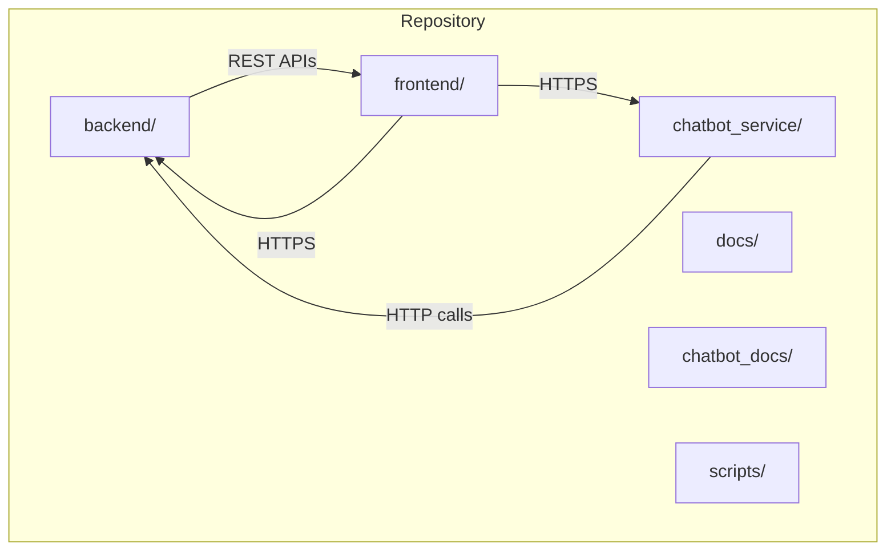
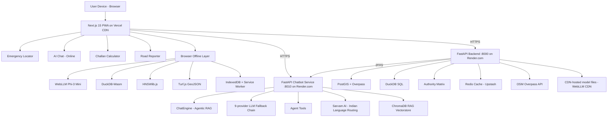
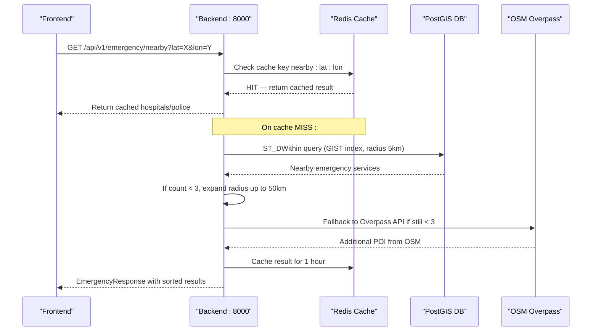
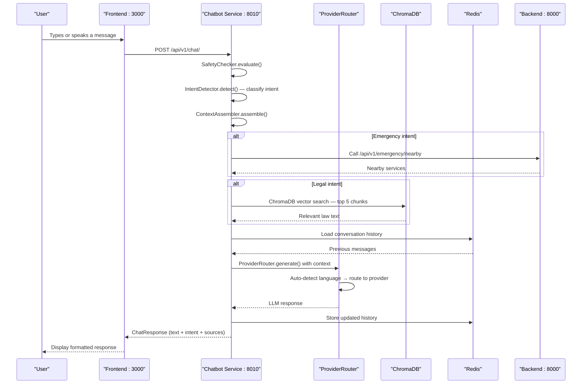
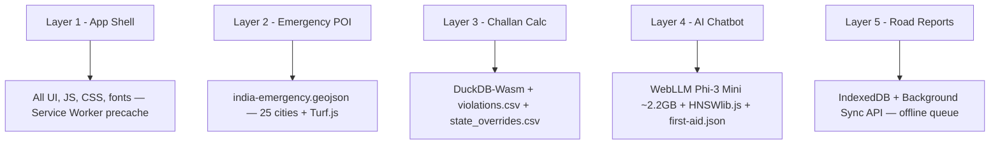
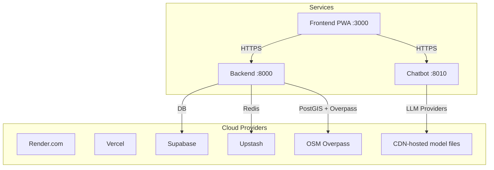
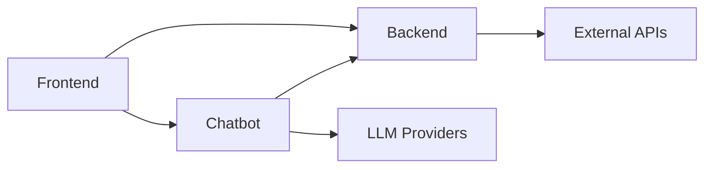

# System Architecture

<cite>
**Referenced Files in This Document**
- [README.md](file://README.md)
- [DESIGN.md](file://DESIGN.md)
- [docs/Architecture.md](file://docs/Architecture.md)
- [docs/Offline_Architecture.md](file://docs/Offline_Architecture.md)
- [render.yaml](file://render.yaml)
- [backend/main.py](file://backend/main.py)
- [chatbot_service/main.py](file://chatbot_service/main.py)
- [frontend/package.json](file://frontend/package.json)
- [frontend/next.config.js](file://frontend/next.config.js)
- [frontend/public/manifest.json](file://frontend/public/manifest.json)
- [frontend/lib/offline-ai.ts](file://frontend/lib/offline-ai.ts)
- [frontend/lib/offline-rag.ts](file://frontend/lib/offline-rag.ts)
- [frontend/lib/offline-sos-queue.ts](file://frontend/lib/offline-sos-queue.ts)
- [frontend/lib/store.ts](file://frontend/lib/store.ts)
- [backend/requirements.txt](file://backend/requirements.txt)
- [chatbot_service/requirements.txt](file://chatbot_service/requirements.txt)
</cite>

## Table of Contents
1. [Introduction](#introduction)
2. [Project Structure](#project-structure)
3. [Core Components](#core-components)
4. [Architecture Overview](#architecture-overview)
5. [Detailed Component Analysis](#detailed-component-analysis)
6. [Dependency Analysis](#dependency-analysis)
7. [Performance Considerations](#performance-considerations)
8. [Troubleshooting Guide](#troubleshooting-guide)
9. [Conclusion](#conclusion)
10. [Appendices](#appendices)

## Introduction
SafeVixAI is a tactical road safety platform built as a three-service microservices architecture: a backend API service, a chatbot service, and a frontend Progressive Web App (PWA). The system emphasizes offline-first capabilities using service workers, IndexedDB, and local AI/ML engines, while maintaining seamless online operation with cloud-hosted services. It targets real-time emergency locator, road reporting, challan calculation, and AI-assisted first aid/legal guidance, with a focus on 25 Indian cities and state-specific overrides.

## Project Structure
The repository is organized as a monorepo with three independent services and supporting documentation and scripts:
- backend/: FastAPI service exposing REST APIs for emergency locator, routing, geocoding, challan calculation, and road reporting.
- chatbot_service/: FastAPI service implementing an agentic RAG chatbot with multi-provider LLM fallback and Indian language routing.
- frontend/: Next.js 15 PWA providing the UI, offline AI (WebLLM/Transformers.js), offline RAG, and offline queues.
- docs/: Comprehensive technical documentation including architecture, API, database, and deployment.
- chatbot_docs/: Chatbot-specific documentation.
- scripts/: Data pipeline scripts for seeding and processing.

**Diagram sources**
- [docs/Architecture.md:208-224](file://docs/Architecture.md#L208-L224)
- [README.md:57-70](file://README.md#L57-L70)

**Section sources**
- [README.md:57-70](file://README.md#L57-L70)
- [docs/Architecture.md:208-224](file://docs/Architecture.md#L208-L224)

## Core Components
- Backend API Service (FastAPI, Python 3.11)
  - Exposes endpoints for emergency locator, routing, geocoding, challan calculation, road reporting, and chat proxy.
  - Integrates PostGIS, Overpass/Nominatim, Redis cache, and DuckDB for offline-capable calculations.
- Chatbot Service (FastAPI, Python 3.11)
  - Agentic RAG chatbot with 9 LLM providers and Indian language routing via Sarvam AI.
  - Uses ChromaDB for vector search and Redis for conversation memory.
- Frontend PWA (Next.js 15, React 19, TypeScript)
  - Offline-first UI with service worker caching, IndexedDB queues, and local AI/ML engines.
  - Provides offline emergency locator, challan calculator (DuckDB-Wasm), offline AI (WebLLM/Transformers.js), and offline RAG.

Key runtime and technology highlights:
- Backend: FastAPI + PostGIS + Redis + DuckDB + Overpass/Nominatim
- Chatbot Service: FastAPI + ChromaDB + LangChain + 9 LLM providers + Sarvam AI
- Frontend: Next.js 15 + React 19 + TypeScript + MapLibre GL + WebLLM + Transformers.js + DuckDB-Wasm + HNSWlib-wasm + IndexedDB + Service Worker

**Section sources**
- [README.md:112-121](file://README.md#L112-L121)
- [backend/requirements.txt:1-46](file://backend/requirements.txt#L1-L46)
- [chatbot_service/requirements.txt:1-53](file://chatbot_service/requirements.txt#L1-L53)
- [frontend/package.json:14-53](file://frontend/package.json#L14-L53)

## Architecture Overview
SafeVixAI employs a three-service microservices architecture with clear separation of concerns and offline-first design.

**Diagram sources**
- [docs/Architecture.md:5-45](file://docs/Architecture.md#L5-L45)

**Section sources**
- [docs/Architecture.md:3-45](file://docs/Architecture.md#L3-L45)

## Detailed Component Analysis

### Backend API Service
Responsibilities:
- Emergency locator using PostGIS and Overpass/Nominatim.
- Challan calculation using DuckDB SQL.
- RoadWatch service integrating authority routing.
- Proxy to chatbot service for integrated chat experiences.
- Centralized caching via Redis.

Lifecycle and initialization:
- Creates and wires services (Overpass, Geocoding, Authority Router, Emergency Locator, Routing, Challan, LLM, RoadWatch) during app lifespan.
- Mounts static uploads directory for temporary offline photo storage.
- Health endpoint validates database and cache availability.

**Diagram sources**
- [docs/Architecture.md:141-165](file://docs/Architecture.md#L141-L165)

**Section sources**
- [backend/main.py:24-128](file://backend/main.py#L24-L128)

### Chatbot Service
Responsibilities:
- Agentic RAG chatbot with intent classification, context assembly, and safety checks.
- Multi-provider LLM fallback chain (Groq, Cerebras, Gemini, GitHub, NVIDIA NIM, OpenRouter, Mistral, Together).
- Indian language routing via Sarvam AI.
- Conversation memory via Redis and local vector store (ChromaDB) for legal RAG.

**Diagram sources**
- [docs/Architecture.md:169-204](file://docs/Architecture.md#L169-L204)

**Section sources**
- [chatbot_service/main.py:41-145](file://chatbot_service/main.py#L41-L145)

### Frontend PWA and Offline-First Architecture
Responsibilities:
- App shell and assets cached via service worker.
- Offline AI using WebLLM/Transformers.js with system AI fallback (Chrome/Android AICore).
- Offline RAG using HNSWlib-wasm and local legal documents.
- Offline queues for SOS events using IndexedDB and background sync.
- Local state management via Zustand with persistence.

**Diagram sources**
- [docs/Architecture.md:128-137](file://docs/Architecture.md#L128-L137)

Key offline modules:
- Offline AI engine: System AI (Chrome/Android AICore) or Transformers.js Gemma 4 E2B with WebGPU acceleration and browser cache.
- Offline RAG: Local keyword/index matching simulating vector similarity search.
- Offline SOS queue: IndexedDB-backed queue with background sync on connectivity restoration.

**Section sources**
- [frontend/lib/offline-ai.ts:1-256](file://frontend/lib/offline-ai.ts#L1-L256)
- [frontend/lib/offline-rag.ts:1-35](file://frontend/lib/offline-rag.ts#L1-L35)
- [frontend/lib/offline-sos-queue.ts:1-138](file://frontend/lib/offline-sos-queue.ts#L1-L138)
- [frontend/lib/store.ts:1-226](file://frontend/lib/store.ts#L1-L226)

### Infrastructure and Deployment Topology
- Backend and Chatbot services deployed on Render.com with HTTPS endpoints.
- Frontend deployed on Vercel as a PWA with service worker caching.
- Core services include Redis (Upstash) and Supabase (PostgreSQL + PostGIS) for caching and spatial data.
- External free services include OSM Overpass API and CDN-hosted model files for WebLLM CDN.

**Diagram sources**
- [docs/Architecture.md:40-45](file://docs/Architecture.md#L40-L45)
- [render.yaml:1-83](file://render.yaml#L1-L83)

**Section sources**
- [docs/Architecture.md:40-45](file://docs/Architecture.md#L40-L45)
- [render.yaml:1-83](file://render.yaml#L1-L83)

## Dependency Analysis
- Service coupling:
  - Frontend depends on Backend for emergency locator and challan calculation, and on Chatbot for integrated chat.
  - Backend proxies to Chatbot for chat-related features.
  - Chatbot depends on Backend for emergency and road data via tool clients.
- External dependencies:
  - Backend integrates PostGIS, Overpass/Nominatim, Redis, DuckDB, and external weather/geocoding APIs.
  - Chatbot integrates 9 LLM providers and ChromaDB.
  - Frontend leverages Transformers.js, WebLLM, DuckDB-Wasm, HNSWlib-wasm, MapLibre GL, and IndexedDB.

**Diagram sources**
- [docs/Architecture.md:27-34](file://docs/Architecture.md#L27-L34)
- [backend/main.py:14-22](file://backend/main.py#L14-L22)
- [chatbot_service/main.py:25-38](file://chatbot_service/main.py#L25-L38)

**Section sources**
- [docs/Architecture.md:27-34](file://docs/Architecture.md#L27-L34)
- [backend/main.py:14-22](file://backend/main.py#L14-L22)
- [chatbot_service/main.py:25-38](file://chatbot_service/main.py#L25-L38)

## Performance Considerations
- Caching:
  - Backend caches emergency locator results in Redis to reduce database and external API calls.
  - Frontend caches offline AI models and assets via service worker and browser cache.
- Offline-first design:
  - Reduces latency and improves reliability by serving cached data and local computations.
- Model optimization:
  - Frontend uses quantized models (e.g., 4-bit) and WebGPU acceleration where available.
- Scalability:
  - Render instances configured with keep-alive timeouts and single worker for cost efficiency.
  - Enterprise-scale offline file uploads and distributed processing require object storage and Supabase Realtime synchronization.

**Section sources**
- [docs/Architecture.md:128-137](file://docs/Architecture.md#L128-L137)
- [docs/Offline_Architecture.md:12-23](file://docs/Offline_Architecture.md#L12-L23)
- [render.yaml:8-9](file://render.yaml#L8-L9)

## Troubleshooting Guide
Common issues and diagnostics:
- Backend health:
  - Health endpoint returns database and cache availability; degraded status indicates database issues.
- Cache and Redis:
  - Verify cache backend name and ping status; ensure Upstash Redis is reachable.
- Frontend offline AI:
  - Check system AI availability (Chrome/Android AICore) and Transformers.js model loading progress.
- Offline queues:
  - IndexedDB queue persists SOS events; ensure background sync is registered and online event handlers are attached.

**Section sources**
- [backend/main.py:103-125](file://backend/main.py#L103-L125)
- [chatbot_service/main.py:106-115](file://chatbot_service/main.py#L106-L115)
- [frontend/lib/offline-ai.ts:47-154](file://frontend/lib/offline-ai.ts#L47-L154)
- [frontend/lib/offline-sos-queue.ts:75-137](file://frontend/lib/offline-sos-queue.ts#L75-L137)

## Conclusion
SafeVixAI’s microservices architecture cleanly separates concerns across backend, chatbot, and frontend services, enabling robust offline-first capabilities through service workers, IndexedDB, DuckDB-Wasm, and local AI engines. The system integrates cloud-hosted services for scalability and resilience, while maintaining stateless operations and free-tier deployments across Render, Vercel, Supabase, and Upstash. The documented offline architecture outlines a clear path to enterprise-grade reliability with object storage and Supabase Realtime for distributed offline resync.

## Appendices

### Technology Stack Decisions
- Backend: FastAPI for performance and async support; PostGIS for spatial queries; Redis for caching; DuckDB for offline computation; Overpass/Nominatim for POI fallback.
- Chatbot Service: LangChain + ChromaDB for RAG; 9 LLM providers for fallback; Sarvam AI for Indian languages.
- Frontend: Next.js 15 for SSR/SSG; WebLLM/Transformers.js for offline AI; DuckDB-Wasm/HNSWlib-wasm for offline RAG; MapLibre GL for maps; IndexedDB for offline queues.

**Section sources**
- [README.md:112-121](file://README.md#L112-L121)
- [backend/requirements.txt:1-46](file://backend/requirements.txt#L1-L46)
- [chatbot_service/requirements.txt:1-53](file://chatbot_service/requirements.txt#L1-L53)
- [frontend/package.json:14-53](file://frontend/package.json#L14-L53)

### Cross-Cutting Concerns
- Security:
  - CORS middleware enabled; rate limiting in chatbot service; environment variables for secrets; health endpoints expose minimal operational data.
- Monitoring:
  - Health endpoints for liveness probes; console logging for offline sync and model loading; telemetry opt-in in settings.
- Disaster Recovery:
  - Render ephemeral disk risk mitigated by transitioning to object storage for offline file uploads; Supabase Realtime for offline queue resync.

**Section sources**
- [backend/main.py:66-72](file://backend/main.py#L66-L72)
- [chatbot_service/main.py:95-104](file://chatbot_service/main.py#L95-L104)
- [docs/Offline_Architecture.md:8-23](file://docs/Offline_Architecture.md#L8-L23)

### System Context Diagrams
- Service boundaries and communication protocols:
  - Frontend communicates with Backend and Chatbot over HTTPS; Backend integrates with external spatial and caching services; Chatbot integrates with LLM providers and internal RAG.
- Data persistence layers:
  - Backend uses Supabase/PostgreSQL with PostGIS; Redis for cache; DuckDB for offline computations; Frontend uses IndexedDB and browser cache.

**Section sources**
- [docs/Architecture.md:5-45](file://docs/Architecture.md#L5-L45)
- [render.yaml:1-83](file://render.yaml#L1-L83)