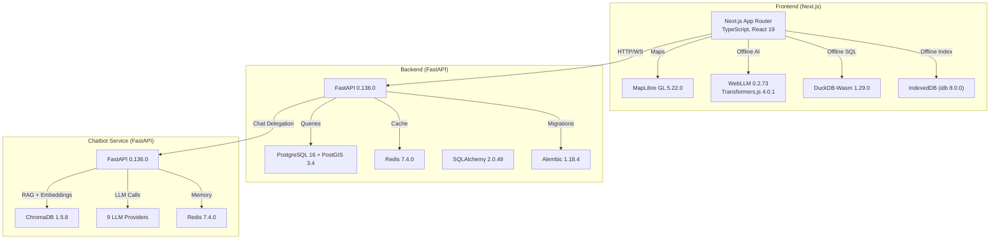
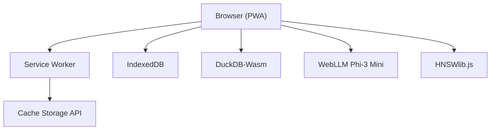
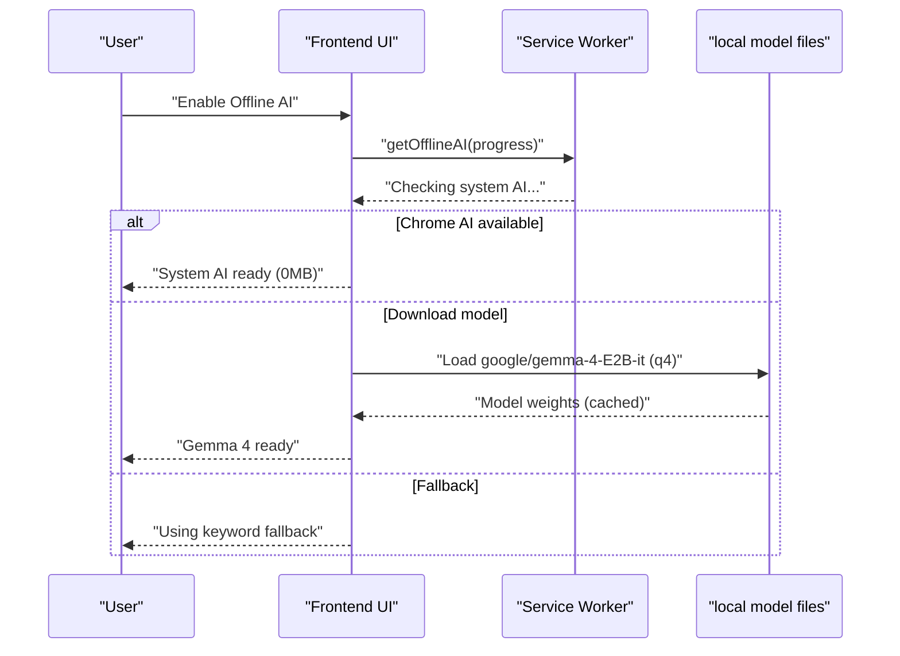
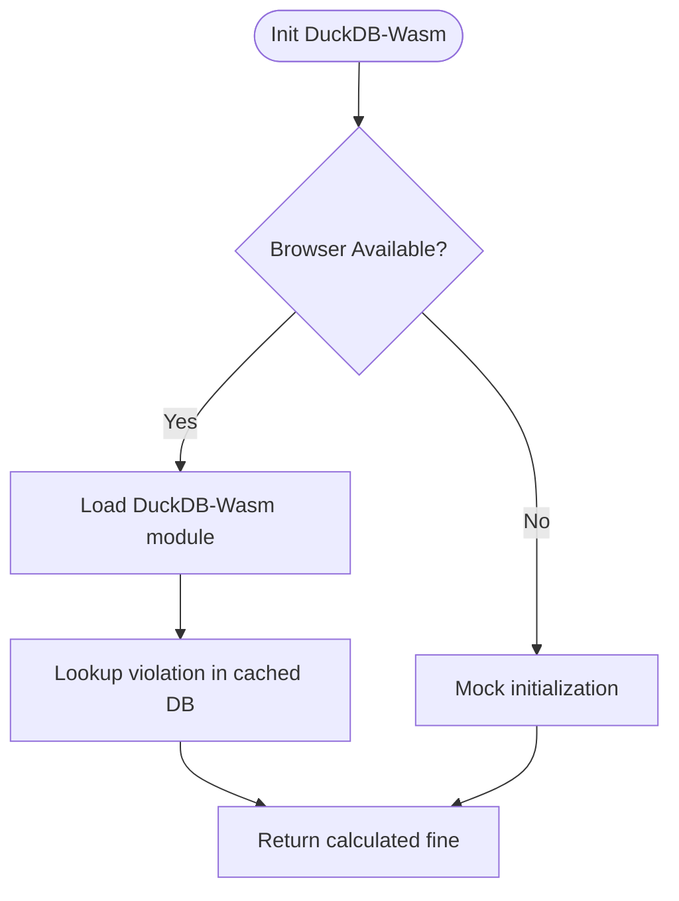
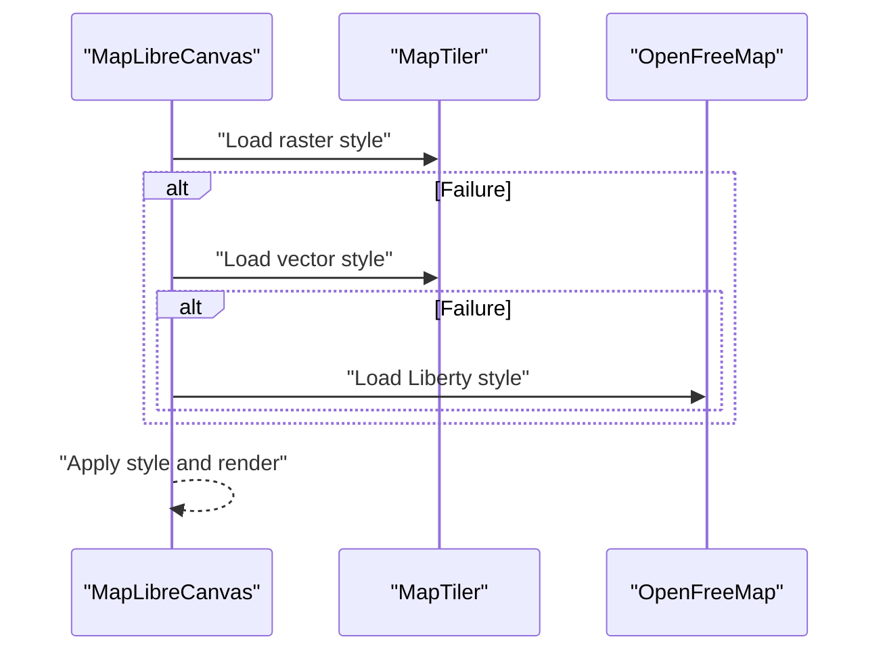
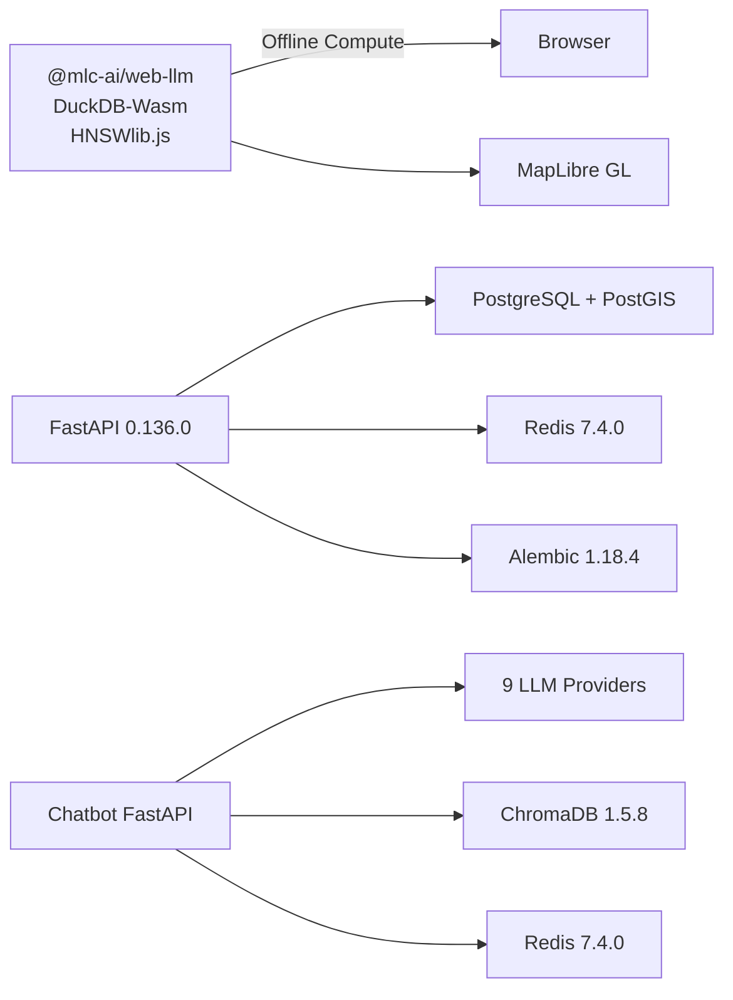

# Technology Stack

<cite>
**Referenced Files in This Document**
- [backend/requirements.txt](file://backend/requirements.txt)
- [chatbot_service/requirements.txt](file://chatbot_service/requirements.txt)
- [frontend/package.json](file://frontend/package.json)
- [backend/main.py](file://backend/main.py)
- [chatbot_service/main.py](file://chatbot_service/main.py)
- [backend/core/config.py](file://backend/core/config.py)
- [chatbot_service/config.py](file://chatbot_service/config.py)
- [backend/core/database.py](file://backend/core/database.py)
- [backend/core/redis_client.py](file://backend/core/redis_client.py)
- [backend/migrations/env.py](file://backend/migrations/env.py)
- [frontend/lib/offline-ai.ts](file://frontend/lib/offline-ai.ts)
- [frontend/lib/duckdb-challan.ts](file://frontend/lib/duckdb-challan.ts)
- [frontend/components/maps/MapLibreCanvas.tsx](file://frontend/components/maps/MapLibreCanvas.tsx)
- [frontend/public/manifest.json](file://frontend/public/manifest.json)
- [docs/TechStack.md](file://docs/TechStack.md)
</cite>

## Table of Contents
1. [Introduction](#introduction)
2. [Project Structure](#project-structure)
3. [Core Components](#core-components)
4. [Architecture Overview](#architecture-overview)
5. [Detailed Component Analysis](#detailed-component-analysis)
6. [Dependency Analysis](#dependency-analysis)
7. [Performance Considerations](#performance-considerations)
8. [Troubleshooting Guide](#troubleshooting-guide)
9. [Conclusion](#conclusion)
10. [Appendices](#appendices)

## Introduction
This document presents the comprehensive technology stack for SafeVixAI’s full-stack architecture. It covers the backend (FastAPI, SQLAlchemy, PostgreSQL with PostGIS, Redis, Alembic), the frontend (Next.js, React, TypeScript, MapLibre GL, WebLLM integration), the chatbot service (ChromaDB, 9 LLM providers, CDN-hosted model files integration, agentic architecture), and the offline technologies (WebLLM Phi-3 Mini, DuckDB-Wasm, HNSWlib.js, service worker implementation). It also includes version compatibility matrices, upgrade paths, and rationale for technology choices.

## Project Structure
SafeVixAI follows a three-service architecture:
- Backend service (FastAPI) exposing REST APIs for emergency, routing, geocoding, and chat delegation.
- Chatbot service (FastAPI) implementing an agentic RAG pipeline with multi-provider LLM fallback.
- Frontend (Next.js) providing a PWA with offline-first AI capabilities, vector maps, and offline data processing.

**Diagram sources**
- [backend/main.py:24-128](file://backend/main.py#L24-L128)
- [chatbot_service/main.py:41-145](file://chatbot_service/main.py#L41-L145)
- [frontend/package.json:14-52](file://frontend/package.json#L14-L52)

**Section sources**
- [backend/main.py:24-128](file://backend/main.py#L24-L128)
- [chatbot_service/main.py:41-145](file://chatbot_service/main.py#L41-L145)
- [frontend/package.json:14-52](file://frontend/package.json#L14-L52)

## Core Components
- Backend stack: FastAPI 0.136.0, SQLAlchemy 2.0.49, PostgreSQL 16 + PostGIS 3.4, Redis 7.4.0, Alembic 1.18.4, httpx, DuckDB, geopandas/shapely/geopy, numpy/pandas/Pillow, Pydantic/pydantic-settings/python-dotenv, python-multipart/aiofiles/pypdf.
- Chatbot service stack: FastAPI 0.136.0, torch/torchaudio/transformers/datasets, ChromaDB 1.5.8, LocalHashEmbeddingFunction (hash-based) 5.4.1, LangChain 1.2.15, langchain-* wrappers, 9 LLM provider SDKs, Redis 7.4.0, httpx/requests, pandas/numpy, pdfplumber/pypdf, pytest/pytest-asyncio.
- Frontend stack: Next.js 15.3.1, React 19.1.0, TypeScript 5.5.3, MapLibre GL 5.22.0, @mlc-ai/web-llm 0.2.73, @huggingface/transformers 4.0.1, @duckdb/duckdb-wasm 1.29.0, hnswlib-wasm, @turf/turf 6.5.0, idb 8.0.0, zustand 4.5.4, swr 2.2.5, axios, motion/react-hot-toast/lucide-react, shadcn, three.js/@react-three/fiber, Tailwind CSS.

**Section sources**
- [backend/requirements.txt:1-49](file://backend/requirements.txt#L1-L49)
- [chatbot_service/requirements.txt:1-53](file://chatbot_service/requirements.txt#L1-L53)
- [frontend/package.json:14-52](file://frontend/package.json#L14-L52)
- [docs/TechStack.md:31-68](file://docs/TechStack.md#L31-L68)

## Architecture Overview
SafeVixAI employs a distributed, offline-first architecture:
- Backend exposes REST endpoints and delegates chat to the chatbot service.
- Frontend is a PWA with offline AI inference (WebLLM Phi-3 Mini), offline SQL (DuckDB-Wasm), and offline vector search (HNSWlib.js).
- Chatbot service orchestrates an agentic RAG pipeline with multi-provider LLM fallback and persistent memory.

**Diagram sources**
- [frontend/lib/offline-ai.ts:114-154](file://frontend/lib/offline-ai.ts#L114-L154)
- [frontend/lib/duckdb-challan.ts:4-18](file://frontend/lib/duckdb-challan.ts#L4-L18)
- [frontend/public/manifest.json:1-68](file://frontend/public/manifest.json#L1-L68)

**Section sources**
- [frontend/lib/offline-ai.ts:114-154](file://frontend/lib/offline-ai.ts#L114-L154)
- [frontend/lib/duckdb-challan.ts:4-18](file://frontend/lib/duckdb-challan.ts#L4-L18)
- [frontend/public/manifest.json:1-68](file://frontend/public/manifest.json#L1-L68)

## Detailed Component Analysis

### Backend Stack
- Framework and server: FastAPI 0.136.0 with Uvicorn standard.
- Database: SQLAlchemy 2.0.49 async ORM, asyncpg driver, PostGIS geometry types via geoalchemy2, Alembic 1.18.4 migrations.
- Cache: Redis 7.4.0 via redis[hiredis] with a unified CacheHelper abstraction supporting memory fallback.
- HTTP client: httpx 0.28.1.
- Geospatial: geopandas 1.1.3, shapely 2.1.2, geopy 2.4.1.
- Data and compute: duckdb 1.5.2, numpy 2.4.4, pandas 3.0.2, Pillow 12.2.0.
- Auth/JWT and validation: python-jose[cryptography] 3.4.0, Pydantic 2.13.2, pydantic-settings 2.13.1, python-dotenv 1.2.2, python-multipart 0.0.26, aiofiles 25.1.0, pypdf 6.10.2.

Key runtime configuration and lifecycle:
- Settings loaded from environment with sensible defaults and normalization helpers.
- Lifespan manages async resources (cache, services) and graceful shutdown.
- Health endpoint checks database and cache availability.

**Section sources**
- [backend/requirements.txt:1-49](file://backend/requirements.txt#L1-L49)
- [backend/core/config.py:11-181](file://backend/core/config.py#L11-L181)
- [backend/core/database.py:16-50](file://backend/core/database.py#L16-L50)
- [backend/core/redis_client.py:136-140](file://backend/core/redis_client.py#L136-L140)
- [backend/migrations/env.py:14-64](file://backend/migrations/env.py#L14-L64)
- [backend/main.py:24-128](file://backend/main.py#L24-L128)

### Chatbot Service Stack
- Framework: FastAPI 0.136.0 with Uvicorn standard and SlowAPI rate limiting.
- ML and NLP: torch 2.11.0, torchaudio 2.11.0, transformers 5.5.4, datasets 4.8.4.
- RAG: ChromaDB 1.5.8, LocalHashEmbeddingFunction (hash-based) 5.4.1, LangChain 1.2.15, langchain-community/openai/google-genai.
- Providers: groq 1.2.0, google-generativeai 0.8.6, openai 2.32.0, mistralai 2.4.0, plus others via provider SDKs.
- Memory and persistence: Redis 7.4.0, ConversationMemoryStore.
- HTTP and data: httpx 0.28.1, requests 2.33.1, pandas 3.0.2, numpy 2.4.4, pypdf 6.10.2, pdfplumber 0.11.9.
- Testing: pytest 9.0.3, pytest-asyncio 1.3.0.

Agent architecture:
- ContextAssembler composes tools and retriever.
- ChatEngine integrates memory, intent detection, safety checking, and provider routing.
- Tools cover SOS, challan calculation, legal search, first aid, road infrastructure, weather, geocoding, and report submission.

**Section sources**
- [chatbot_service/requirements.txt:1-53](file://chatbot_service/requirements.txt#L1-L53)
- [chatbot_service/config.py:40-126](file://chatbot_service/config.py#L40-L126)
- [chatbot_service/main.py:41-145](file://chatbot_service/main.py#L41-L145)

### Frontend Stack
- Framework: Next.js 15.3.1, React 19.1.0, TypeScript 5.5.3, Tailwind CSS 3.4.10.
- Maps: MapLibre GL 5.22.0 with dynamic SSR toggles and multiple fallback styles (MapTiler raster/vector, OpenFreeMap).
- AI and vision: @mlc-ai/web-llm 0.2.73 for Phi-3 Mini, @huggingface/transformers 4.0.1 for YOLOv8n and embeddings, @turf/turf 6.5.0 for geospatial filtering.
- Edge SQL and vector search: @duckdb/duckdb-wasm 1.29.0, hnswlib-wasm, idb 8.0.0.
- State and UX: zustand 4.5.4, swr 2.2.5, axios 1.7.7, motion 12.7.3, react-hot-toast 2.4.1, lucide-react 0.427.0, shadcn, three.js 0.169.0, @react-three/fiber 9.1.0.
- PWA: manifest.json defines offline behavior, shortcuts, and screenshots.

Offline technologies:
- WebLLM Phi-3 Mini 4-bit (WebGPU) with deterministic keyword fallback.
- DuckDB-Wasm for offline challan calculations.
- HNSWlib.js for approximate nearest neighbor search in the browser.
- Service Worker and Cache Storage for offline caching and background sync.

**Section sources**
- [frontend/package.json:14-52](file://frontend/package.json#L14-L52)
- [frontend/components/maps/MapLibreCanvas.tsx:300-560](file://frontend/components/maps/MapLibreCanvas.tsx#L300-L560)
- [frontend/lib/offline-ai.ts:114-154](file://frontend/lib/offline-ai.ts#L114-L154)
- [frontend/lib/duckdb-challan.ts:4-18](file://frontend/lib/duckdb-challan.ts#L4-L18)
- [frontend/public/manifest.json:1-68](file://frontend/public/manifest.json#L1-L68)

### Offline AI Pipeline (WebLLM)

**Diagram sources**
- [frontend/lib/offline-ai.ts:114-154](file://frontend/lib/offline-ai.ts#L114-L154)

**Section sources**
- [frontend/lib/offline-ai.ts:114-154](file://frontend/lib/offline-ai.ts#L114-L154)

### Offline Challan Calculation (DuckDB-Wasm)

**Diagram sources**
- [frontend/lib/duckdb-challan.ts:4-18](file://frontend/lib/duckdb-challan.ts#L4-L18)

**Section sources**
- [frontend/lib/duckdb-challan.ts:4-18](file://frontend/lib/duckdb-challan.ts#L4-L18)

### Map Rendering and Fallback Styles

**Diagram sources**
- [frontend/components/maps/MapLibreCanvas.tsx:326-380](file://frontend/components/maps/MapLibreCanvas.tsx#L326-L380)

**Section sources**
- [frontend/components/maps/MapLibreCanvas.tsx:326-380](file://frontend/components/maps/MapLibreCanvas.tsx#L326-L380)

## Dependency Analysis
- Backend depends on:
  - FastAPI for routing and lifespan management.
  - SQLAlchemy 2.0.49 with asyncpg for async database operations.
  - Redis 7.4.0 for caching and rate limiting.
  - Alembic 1.18.4 for database migrations.
  - Geospatial libraries for spatial operations.
- Chatbot service depends on:
  - FastAPI for the agent API.
  - ChromaDB 1.5.8 for local persistent vector storage.
  - 9 LLM provider SDKs for multi-provider fallback.
  - Redis 7.4.0 for conversation memory.
- Frontend depends on:
  - Next.js 15.3.1 for SSR/PWA.
  - MapLibre GL 5.22.0 for vector maps.
  - WebLLM 0.2.73 and Transformers.js 4.0.1 for offline AI.
  - DuckDB-Wasm 1.29.0 and HNSWlib.js for offline compute.

**Diagram sources**
- [backend/requirements.txt:1-49](file://backend/requirements.txt#L1-L49)
- [chatbot_service/requirements.txt:1-53](file://chatbot_service/requirements.txt#L1-L53)
- [frontend/package.json:14-52](file://frontend/package.json#L14-L52)

**Section sources**
- [backend/requirements.txt:1-49](file://backend/requirements.txt#L1-L49)
- [chatbot_service/requirements.txt:1-53](file://chatbot_service/requirements.txt#L1-L53)
- [frontend/package.json:14-52](file://frontend/package.json#L14-L52)

## Performance Considerations
- Asynchronous I/O: Backend leverages SQLAlchemy asyncio and asyncpg for scalable database operations.
- Caching: Unified CacheHelper abstracts Redis with memory fallback to reduce latency and improve resilience.
- Offline-first: Frontend caches model weights, tiles, and GeoJSON via Service Worker and Cache Storage to minimize network usage.
- Vector search: HNSWlib.js enables efficient approximate nearest neighbor search in the browser.
- Map rendering: Multiple fallback styles ensure fast and reliable map loading under varying network conditions.

[No sources needed since this section provides general guidance]

## Troubleshooting Guide
- Database connectivity: Health endpoint checks database availability; backend uses async engine with pre-ping and pool settings.
- Cache availability: CacheHelper attempts Redis and falls back to in-memory storage; ping indicates backend health.
- CORS configuration: Settings.normalize_* helpers ensure proper URL normalization and CORS origins handling.
- Chatbot provider configuration: At least one LLM provider key must be present; otherwise, a fatal error is raised during settings load.

**Section sources**
- [backend/main.py:103-125](file://backend/main.py#L103-L125)
- [backend/core/redis_client.py:115-125](file://backend/core/redis_client.py#L115-L125)
- [backend/core/config.py:86-96](file://backend/core/config.py#L86-L96)
- [chatbot_service/config.py:123-126](file://chatbot_service/config.py#L123-L126)

## Conclusion
SafeVixAI’s stack balances modern cloud-native development with robust offline-first capabilities. The backend and chatbot services provide scalable, maintainable APIs with strong typing and async I/O, while the frontend delivers a responsive PWA with offline AI, SQL, and vector search. The chosen technologies enable cost-effective deployment, global accessibility, and a seamless user experience across online and offline contexts.

[No sources needed since this section summarizes without analyzing specific files]

## Appendices

### Version Compatibility Matrix
- Backend
  - FastAPI 0.136.0
  - SQLAlchemy 2.0.49 + asyncpg 0.31.0
  - Redis 7.4.0
  - Alembic 1.18.4
  - PostGIS 3.4 (via geoalchemy2 0.19.0)
- Chatbot Service
  - FastAPI 0.136.0
  - ChromaDB 1.5.8
  - LocalHashEmbeddingFunction (hash-based) 5.4.1
  - 9 LLM provider SDKs
  - Redis 7.4.0
- Frontend
  - Next.js 15.3.1
  - React 19.1.0
  - TypeScript 5.5.3
  - MapLibre GL 5.22.0
  - @mlc-ai/web-llm 0.2.73
  - @huggingface/transformers 4.0.1
  - @duckdb/duckdb-wasm 1.29.0
  - hnswlib-wasm
  - @turf/turf 6.5.0
  - idb 8.0.0

**Section sources**
- [backend/requirements.txt:1-49](file://backend/requirements.txt#L1-L49)
- [chatbot_service/requirements.txt:1-53](file://chatbot_service/requirements.txt#L1-L53)
- [frontend/package.json:14-52](file://frontend/package.json#L14-L52)
- [docs/TechStack.md:31-189](file://docs/TechStack.md#L31-L189)

### Upgrade Paths
- Backend
  - FastAPI: Align with uvicorn 0.44.0 constraints; verify asyncpg and Alembic compatibility.
  - SQLAlchemy: Ensure asyncpg and geoalchemy2 versions remain compatible; test migrations after upgrades.
  - Redis: Maintain 7.x compatibility; verify client options and connection pooling.
- Chatbot Service
  - FastAPI: Same alignment as backend; validate provider SDKs and transformers compatibility.
  - ChromaDB: Test persistence and retrieval behavior after updates.
  - LocalHashEmbeddingFunction (hash-based): Verify embedding model compatibility and performance.
- Frontend
  - Next.js 15.x: Validate App Router behavior and SSR/SSG changes.
  - React 19.x: Ensure hooks and concurrent features compatibility.
  - MapLibre GL: Test style URLs and fallback logic after major updates.
  - WebLLM/Transformers.js: Validate model loading and caching behavior.

**Section sources**
- [backend/requirements.txt:4-5](file://backend/requirements.txt#L4-L5)
- [chatbot_service/requirements.txt:11-12](file://chatbot_service/requirements.txt#L11-L12)
- [frontend/package.json:33, 38](file://frontend/package.json#L33,L38)

### Rationale for Technology Choices
- Backend
  - FastAPI 0.136.0: Strong async support, automatic OpenAPI generation, excellent developer ergonomics.
  - SQLAlchemy 2.0.49: Modern async ORM with improved typing and performance.
  - Redis 7.4.0: High-performance caching and memory-backed conversation storage.
  - Alembic 1.18.4: Reliable database migrations with async support.
  - PostGIS 3.4: Spatial data types and functions for road safety use cases.
- Chatbot Service
  - ChromaDB 1.5.8: Lightweight, local persistent vector store suitable for RAG.
  - 9 LLM providers: Multi-provider fallback ensures availability and cost control.
  - Transformers.js: Enables offline inference for privacy and reliability.
- Frontend
  - Next.js 15.3.1: App Router, ISR, and PWA capabilities.
  - MapLibre GL 5.22.0: Vector tiles, modular styles, and offline-friendly rendering.
  - WebLLM + Transformers.js: Client-side LLM inference with WebGPU acceleration.
  - DuckDB-Wasm + HNSWlib.js: Offline SQL and vector search for responsive UX.

**Section sources**
- [docs/TechStack.md:31-189](file://docs/TechStack.md#L31-L189)

## HuggingFace Dataset Hub

SafeVixAI publishes its curated datasets on the **[HuggingFace Dataset Hub](https://huggingface.co/datasets/SafeVixAI/SafeVixAI-Dataset-Hub)** for research reproducibility and community collaboration. This includes:

- Emergency service coordinates for 25 Indian cities
- Motor Vehicle Act violation databases with state-specific overrides
- Road infrastructure GeoJSON datasets (PMGSY, NHAI, toll plazas)
- ChromaDB vector store training corpora (legal documents, first aid guides, WHO road safety data)

> **Note**: The HuggingFace Dataset Hub is a *data hosting* layer — models are served via WebLLM CDN and LLM providers (Groq, Gemini, etc.), not from HuggingFace model inference.
