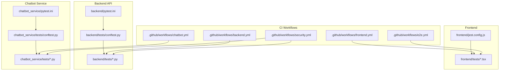
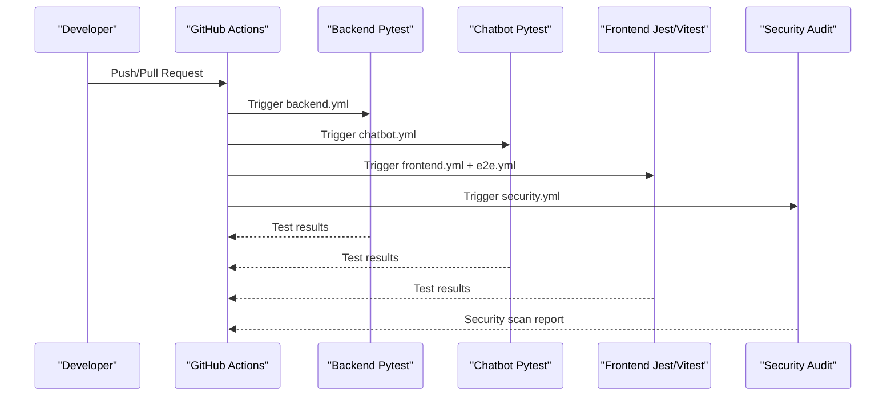
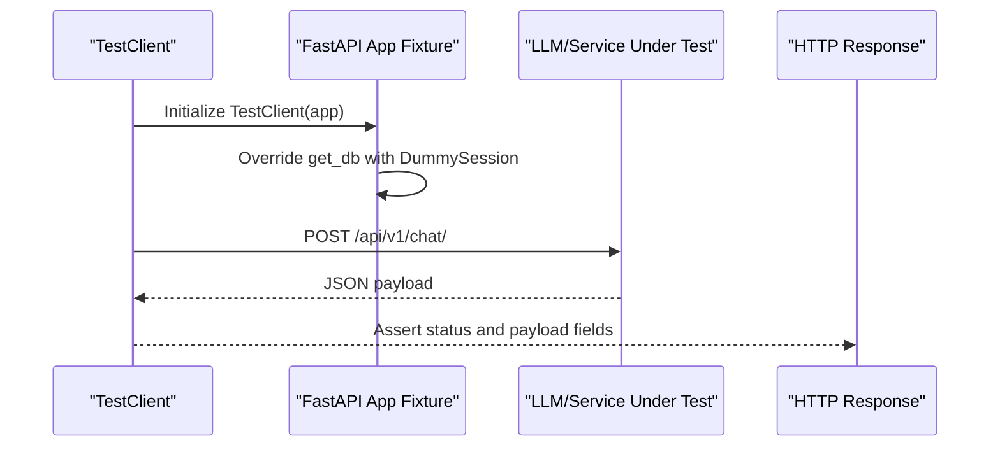
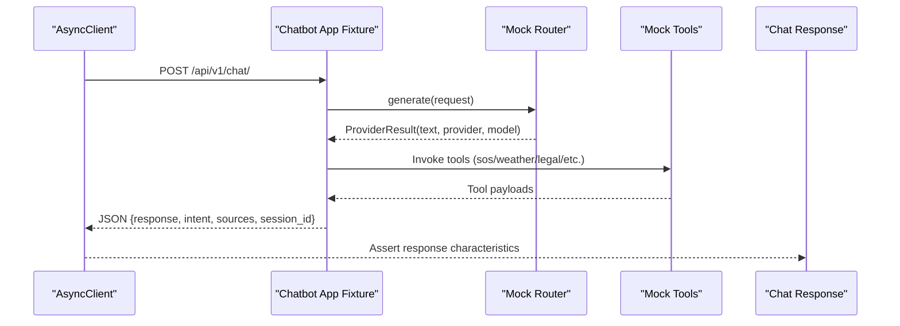
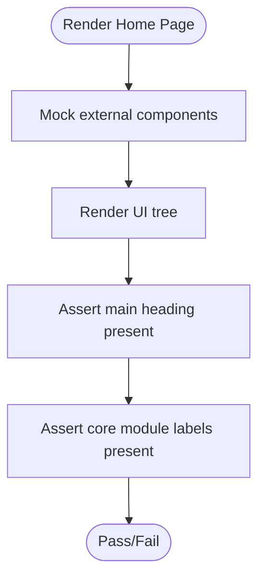
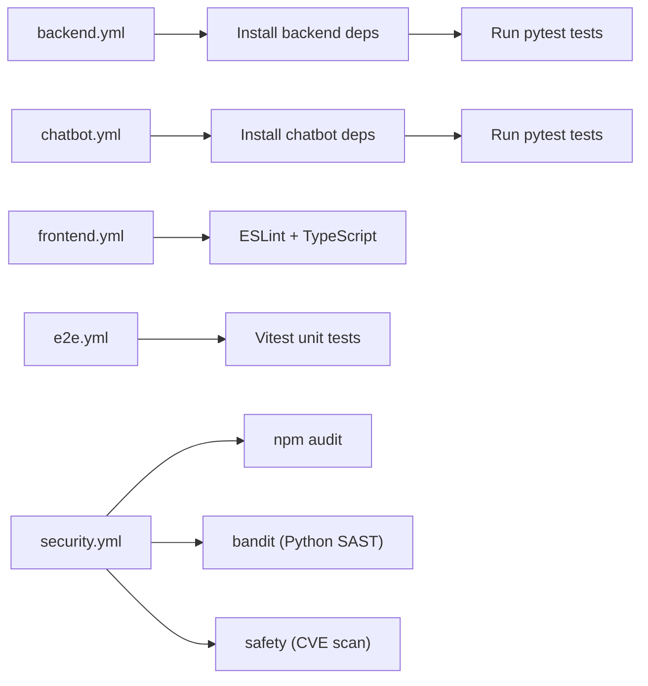
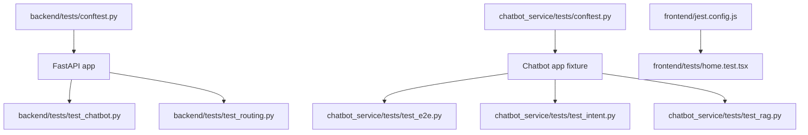

# Testing Strategy

<cite>
**Referenced Files in This Document**
- [backend/pytest.ini](https://github.com/SafeVixAI/SafeVixAI/blob/main/backend/pytest.ini)
- [chatbot_service/pytest.ini](https://github.com/SafeVixAI/SafeVixAI/blob/main/chatbot_service/pytest.ini)
- [frontend/jest.config.js](https://github.com/SafeVixAI/SafeVixAI/blob/main/frontend/jest.config.js)
- [backend/tests/conftest.py](https://github.com/SafeVixAI/SafeVixAI/blob/main/backend/tests/conftest.py)
- [chatbot_service/tests/conftest.py](https://github.com/SafeVixAI/SafeVixAI/blob/main/chatbot_service/tests/conftest.py)
- [.github/workflows/backend.yml](https://github.com/SafeVixAI/SafeVixAI/blob/main/.github/workflows/backend.yml)
- [.github/workflows/chatbot.yml](https://github.com/SafeVixAI/SafeVixAI/blob/main/.github/workflows/chatbot.yml)
- [.github/workflows/frontend.yml](https://github.com/SafeVixAI/SafeVixAI/blob/main/.github/workflows/frontend.yml)
- [.github/workflows/e2e.yml](https://github.com/SafeVixAI/SafeVixAI/blob/main/.github/workflows/e2e.yml)
- [.github/workflows/security.yml](https://github.com/SafeVixAI/SafeVixAI/blob/main/.github/workflows/security.yml)
- [backend/tests/test_chatbot.py](https://github.com/SafeVixAI/SafeVixAI/blob/main/backend/tests/test_chatbot.py)
- [backend/tests/test_routing.py](https://github.com/SafeVixAI/SafeVixAI/blob/main/backend/tests/test_routing.py)
- [chatbot_service/tests/test_e2e.py](https://github.com/SafeVixAI/SafeVixAI/blob/main/chatbot_service/tests/test_e2e.py)
- [chatbot_service/tests/test_intent.py](https://github.com/SafeVixAI/SafeVixAI/blob/main/chatbot_service/tests/test_intent.py)
- [chatbot_service/tests/test_rag.py](https://github.com/SafeVixAI/SafeVixAI/blob/main/chatbot_service/tests/test_rag.py)
- [frontend/tests/home.test.tsx](https://github.com/SafeVixAI/SafeVixAI/blob/main/frontend/tests/home.test.tsx)
</cite>

## Table of Contents
1. [Introduction](#introduction)
2. [Project Structure](#project-structure)
3. [Core Components](#core-components)
4. [Architecture Overview](#architecture-overview)
5. [Detailed Component Analysis](#detailed-component-analysis)
6. [Dependency Analysis](#dependency-analysis)
7. [Performance Considerations](#performance-considerations)
8. [Troubleshooting Guide](#troubleshooting-guide)
9. [Conclusion](#conclusion)
10. [Appendices](#appendices)

## Introduction
This document defines the comprehensive testing strategy for SafeVixAI across its multi-service stack. It covers unit testing, integration testing, and end-to-end validation using FastAPI Pytest, Next.js Jest/Vitest, and specialized chatbot testing frameworks. It also documents mock setups, test data management, continuous integration pipelines, performance and security testing, coverage expectations, and operational validation practices. The goal is to enable both beginners and QA engineers to confidently contribute to and maintain high-quality software.

## Project Structure
SafeVixAI is organized into three major services:
- Backend API service built with FastAPI
- Chatbot service with RAG, tools, and provider integrations
- Frontend Next.js application

Each service maintains its own test configuration and CI workflows, enabling independent and focused testing.

**Diagram sources**
- [backend/pytest.ini:1-5](https://github.com/SafeVixAI/SafeVixAI/blob/main/backend/pytest.ini#L1-L5)
- [chatbot_service/pytest.ini:1-4](https://github.com/SafeVixAI/SafeVixAI/blob/main/chatbot_service/pytest.ini#L1-L4)
- [frontend/jest.config.js:1-16](https://github.com/SafeVixAI/SafeVixAI/blob/main/frontend/jest.config.js#L1-L16)
- [backend/tests/conftest.py:1-31](https://github.com/SafeVixAI/SafeVixAI/blob/main/backend/tests/conftest.py#L1-L31)
- [chatbot_service/tests/conftest.py:1-10](https://github.com/SafeVixAI/SafeVixAI/blob/main/chatbot_service/tests/conftest.py#L1-L10)
- [.github/workflows/backend.yml:1-55](https://github.com/SafeVixAI/SafeVixAI/blob/main/.github/workflows/backend.yml#L1-L55)
- [.github/workflows/chatbot.yml:1-55](https://github.com/SafeVixAI/SafeVixAI/blob/main/.github/workflows/chatbot.yml#L1-L55)
- [.github/workflows/frontend.yml:1-43](https://github.com/SafeVixAI/SafeVixAI/blob/main/.github/workflows/frontend.yml#L1-L43)
- [.github/workflows/e2e.yml:1-43](https://github.com/SafeVixAI/SafeVixAI/blob/main/.github/workflows/e2e.yml#L1-L43)
- [.github/workflows/security.yml:1-64](https://github.com/SafeVixAI/SafeVixAI/blob/main/.github/workflows/security.yml#L1-L64)

**Section sources**
- [backend/pytest.ini:1-5](https://github.com/SafeVixAI/SafeVixAI/blob/main/backend/pytest.ini#L1-L5)
- [chatbot_service/pytest.ini:1-4](https://github.com/SafeVixAI/SafeVixAI/blob/main/chatbot_service/pytest.ini#L1-L4)
- [frontend/jest.config.js:1-16](https://github.com/SafeVixAI/SafeVixAI/blob/main/frontend/jest.config.js#L1-L16)
- [backend/tests/conftest.py:1-31](https://github.com/SafeVixAI/SafeVixAI/blob/main/backend/tests/conftest.py#L1-L31)
- [chatbot_service/tests/conftest.py:1-10](https://github.com/SafeVixAI/SafeVixAI/blob/main/chatbot_service/tests/conftest.py#L1-L10)
- [.github/workflows/backend.yml:1-55](https://github.com/SafeVixAI/SafeVixAI/blob/main/.github/workflows/backend.yml#L1-L55)
- [.github/workflows/chatbot.yml:1-55](https://github.com/SafeVixAI/SafeVixAI/blob/main/.github/workflows/chatbot.yml#L1-L55)
- [.github/workflows/frontend.yml:1-43](https://github.com/SafeVixAI/SafeVixAI/blob/main/.github/workflows/frontend.yml#L1-L43)
- [.github/workflows/e2e.yml:1-43](https://github.com/SafeVixAI/SafeVixAI/blob/main/.github/workflows/e2e.yml#L1-L43)
- [.github/workflows/security.yml:1-64](https://github.com/SafeVixAI/SafeVixAI/blob/main/.github/workflows/security.yml#L1-L64)

## Core Components
- Backend FastAPI service
  - Pytest configuration and fixtures for app bootstrapping and dependency overrides
  - Endpoint-specific tests validating routing, chatbot integration, and business logic
- Chatbot service
  - Pytest configuration optimized for async workflows
  - Comprehensive end-to-end tests simulating conversational flows, tools, and provider routing
  - Unit tests for intent detection, retrieval, and provider behavior
- Frontend Next.js
  - Jest configuration for DOM environment and setup
  - UI component tests verifying structural rendering and module presence

Key testing artifacts:
- Backend app fixture and dependency override pattern
- Chatbot async app lifecycle and extensive mock factories
- Frontend DOM assertions and component rendering checks

**Section sources**
- [backend/tests/conftest.py:18-31](https://github.com/SafeVixAI/SafeVixAI/blob/main/backend/tests/conftest.py#L18-L31)
- [chatbot_service/pytest.ini:1-4](https://github.com/SafeVixAI/SafeVixAI/blob/main/chatbot_service/pytest.ini#L1-L4)
- [chatbot_service/tests/test_e2e.py:219-236](https://github.com/SafeVixAI/SafeVixAI/blob/main/chatbot_service/tests/test_e2e.py#L219-L236)
- [frontend/jest.config.js:1-16](https://github.com/SafeVixAI/SafeVixAI/blob/main/frontend/jest.config.js#L1-L16)
- [frontend/tests/home.test.tsx:1-25](https://github.com/SafeVixAI/SafeVixAI/blob/main/frontend/tests/home.test.tsx#L1-L25)

## Architecture Overview
The testing architecture integrates per-service test suites with dedicated CI jobs. Security scanning is performed independently, and frontend unit tests are executed via Vitest in a separate workflow.

**Diagram sources**
- [.github/workflows/backend.yml:1-55](https://github.com/SafeVixAI/SafeVixAI/blob/main/.github/workflows/backend.yml#L1-L55)
- [.github/workflows/chatbot.yml:1-55](https://github.com/SafeVixAI/SafeVixAI/blob/main/.github/workflows/chatbot.yml#L1-L55)
- [.github/workflows/frontend.yml:1-43](https://github.com/SafeVixAI/SafeVixAI/blob/main/.github/workflows/frontend.yml#L1-L43)
- [.github/workflows/e2e.yml:1-43](https://github.com/SafeVixAI/SafeVixAI/blob/main/.github/workflows/e2e.yml#L1-L43)
- [.github/workflows/security.yml:1-64](https://github.com/SafeVixAI/SafeVixAI/blob/main/.github/workflows/security.yml#L1-L64)

## Detailed Component Analysis

### Backend API Testing
- Pytest configuration
  - Sets test discovery path and asyncio mode for async fixtures
- App fixture and dependency override
  - Creates a FastAPI app instance and injects a dummy DB session to bypass persistence
- Example tests
  - Chat endpoint test mocks the LLM service and asserts response shape and fields
  - Routing preview test validates route computation and invalid profile handling

**Diagram sources**
- [backend/tests/conftest.py:22-31](https://github.com/SafeVixAI/SafeVixAI/blob/main/backend/tests/conftest.py#L22-L31)
- [backend/tests/test_chatbot.py:16-33](https://github.com/SafeVixAI/SafeVixAI/blob/main/backend/tests/test_chatbot.py#L16-L33)

**Section sources**
- [backend/pytest.ini:1-5](https://github.com/SafeVixAI/SafeVixAI/blob/main/backend/pytest.ini#L1-L5)
- [backend/tests/conftest.py:18-31](https://github.com/SafeVixAI/SafeVixAI/blob/main/backend/tests/conftest.py#L18-L31)
- [backend/tests/test_chatbot.py:1-33](https://github.com/SafeVixAI/SafeVixAI/blob/main/backend/tests/test_chatbot.py#L1-L33)
- [backend/tests/test_routing.py:1-97](https://github.com/SafeVixAI/SafeVixAI/blob/main/backend/tests/test_routing.py#L1-L97)

### Chatbot Service Testing
- Pytest configuration
  - Strict asyncio mode and function-scoped loop for deterministic async tests
- End-to-end test suite
  - Extensive mock factories simulate memory stores, vector store, retrievers, tools, and provider routers
  - Async client lifecycle ensures proper lifespan management during tests
  - Tests cover English/Tamil queries, emergency routing with coordinates, and tool integration
- Unit tests
  - Intent detection classification for emergency and challan-related queries
  - Retrieval accuracy against legal knowledge base content

**Diagram sources**
- [chatbot_service/pytest.ini:1-4](https://github.com/SafeVixAI/SafeVixAI/blob/main/chatbot_service/pytest.ini#L1-L4)
- [chatbot_service/tests/test_e2e.py:219-236](https://github.com/SafeVixAI/SafeVixAI/blob/main/chatbot_service/tests/test_e2e.py#L219-L236)
- [chatbot_service/tests/test_e2e.py:247-309](https://github.com/SafeVixAI/SafeVixAI/blob/main/chatbot_service/tests/test_e2e.py#L247-L309)

**Section sources**
- [chatbot_service/pytest.ini:1-4](https://github.com/SafeVixAI/SafeVixAI/blob/main/chatbot_service/pytest.ini#L1-L4)
- [chatbot_service/tests/test_e2e.py:1-309](https://github.com/SafeVixAI/SafeVixAI/blob/main/chatbot_service/tests/test_e2e.py#L1-L309)
- [chatbot_service/tests/test_intent.py:1-14](https://github.com/SafeVixAI/SafeVixAI/blob/main/chatbot_service/tests/test_intent.py#L1-L14)
- [chatbot_service/tests/test_rag.py:1-18](https://github.com/SafeVixAI/SafeVixAI/blob/main/chatbot_service/tests/test_rag.py#L1-L18)

### Frontend Testing
- Jest configuration
  - Uses next/jest to load Next.js config and sets jsdom environment
  - Imports a setup file for global test utilities
- UI test example
  - Renders the home page and asserts presence of key headings and module labels
  - Mocks external components (e.g., navigation) to isolate UI assertions

**Diagram sources**
- [frontend/jest.config.js:1-16](https://github.com/SafeVixAI/SafeVixAI/blob/main/frontend/jest.config.js#L1-L16)
- [frontend/tests/home.test.tsx:5-10](https://github.com/SafeVixAI/SafeVixAI/blob/main/frontend/tests/home.test.tsx#L5-L10)
- [frontend/tests/home.test.tsx:12-24](https://github.com/SafeVixAI/SafeVixAI/blob/main/frontend/tests/home.test.tsx#L12-L24)

**Section sources**
- [frontend/jest.config.js:1-16](https://github.com/SafeVixAI/SafeVixAI/blob/main/frontend/jest.config.js#L1-L16)
- [frontend/tests/home.test.tsx:1-25](https://github.com/SafeVixAI/SafeVixAI/blob/main/frontend/tests/home.test.tsx#L1-L25)

### Continuous Integration Testing
- Backend CI
  - Installs dependencies, runs Pytest, and supplies stub environment variables for configuration
- Chatbot CI
  - Installs dependencies, runs Pytest, and supplies stub environment variables for settings
- Frontend CI
  - Lints and type-checks TypeScript; does not run unit tests in this workflow
- E2E CI
  - Runs Vitest for frontend unit tests
- Security CI
  - Performs npm audit, Python Bandit SAST scans, and Safety dependency CVE checks across both backend and chatbot services

**Diagram sources**
- [.github/workflows/backend.yml:32-55](https://github.com/SafeVixAI/SafeVixAI/blob/main/.github/workflows/backend.yml#L32-L55)
- [.github/workflows/chatbot.yml:32-55](https://github.com/SafeVixAI/SafeVixAI/blob/main/.github/workflows/chatbot.yml#L32-L55)
- [.github/workflows/frontend.yml:36-43](https://github.com/SafeVixAI/SafeVixAI/blob/main/.github/workflows/frontend.yml#L36-L43)
- [.github/workflows/e2e.yml:35-43](https://github.com/SafeVixAI/SafeVixAI/blob/main/.github/workflows/e2e.yml#L35-L43)
- [.github/workflows/security.yml:30-64](https://github.com/SafeVixAI/SafeVixAI/blob/main/.github/workflows/security.yml#L30-L64)

**Section sources**
- [.github/workflows/backend.yml:1-55](https://github.com/SafeVixAI/SafeVixAI/blob/main/.github/workflows/backend.yml#L1-L55)
- [.github/workflows/chatbot.yml:1-55](https://github.com/SafeVixAI/SafeVixAI/blob/main/.github/workflows/chatbot.yml#L1-L55)
- [.github/workflows/frontend.yml:1-43](https://github.com/SafeVixAI/SafeVixAI/blob/main/.github/workflows/frontend.yml#L1-L43)
- [.github/workflows/e2e.yml:1-43](https://github.com/SafeVixAI/SafeVixAI/blob/main/.github/workflows/e2e.yml#L1-L43)
- [.github/workflows/security.yml:1-64](https://github.com/SafeVixAI/SafeVixAI/blob/main/.github/workflows/security.yml#L1-L64)

## Dependency Analysis
- Backend
  - Test app fixture depends on the FastAPI application factory and database dependency override
  - Endpoint tests rely on TestClient and injected service mocks
- Chatbot
  - Async app fixture manages lifespan and ASGI transport for AsyncClient
  - Extensive monkeypatching replaces real components with deterministic mocks
- Frontend
  - Tests depend on jsdom environment and component rendering utilities

**Diagram sources**
- [backend/tests/conftest.py:14-31](https://github.com/SafeVixAI/SafeVixAI/blob/main/backend/tests/conftest.py#L14-L31)
- [backend/tests/test_chatbot.py:16-33](https://github.com/SafeVixAI/SafeVixAI/blob/main/backend/tests/test_chatbot.py#L16-L33)
- [backend/tests/test_routing.py:67-97](https://github.com/SafeVixAI/SafeVixAI/blob/main/backend/tests/test_routing.py#L67-L97)
- [chatbot_service/tests/conftest.py:1-10](https://github.com/SafeVixAI/SafeVixAI/blob/main/chatbot_service/tests/conftest.py#L1-L10)
- [chatbot_service/tests/test_e2e.py:219-236](https://github.com/SafeVixAI/SafeVixAI/blob/main/chatbot_service/tests/test_e2e.py#L219-L236)
- [chatbot_service/tests/test_intent.py:6-14](https://github.com/SafeVixAI/SafeVixAI/blob/main/chatbot_service/tests/test_intent.py#L6-L14)
- [chatbot_service/tests/test_rag.py:9-18](https://github.com/SafeVixAI/SafeVixAI/blob/main/chatbot_service/tests/test_rag.py#L9-L18)
- [frontend/jest.config.js:1-16](https://github.com/SafeVixAI/SafeVixAI/blob/main/frontend/jest.config.js#L1-L16)
- [frontend/tests/home.test.tsx:1-25](https://github.com/SafeVixAI/SafeVixAI/blob/main/frontend/tests/home.test.tsx#L1-L25)

**Section sources**
- [backend/tests/conftest.py:1-31](https://github.com/SafeVixAI/SafeVixAI/blob/main/backend/tests/conftest.py#L1-L31)
- [chatbot_service/tests/conftest.py:1-10](https://github.com/SafeVixAI/SafeVixAI/blob/main/chatbot_service/tests/conftest.py#L1-L10)
- [frontend/jest.config.js:1-16](https://github.com/SafeVixAI/SafeVixAI/blob/main/frontend/jest.config.js#L1-L16)

## Performance Considerations
- Current test suite focuses on correctness and integration rather than performance or load testing.
- Recommended additions:
  - Introduce synthetic latency in service mocks to detect slow endpoints
  - Use profiling tools to measure test execution time and identify hotspots
  - Add load tests using Locust or k6 against staging environments for critical paths (chat, routing)
  - Monitor memory usage during long-running test sessions
- Keep performance tests out of CI by default; run them on scheduled pipelines or developer machines.

[No sources needed since this section provides general guidance]

## Troubleshooting Guide
- Async fixture scope issues
  - Ensure asyncio mode matches the service configuration (auto for backend, strict for chatbot)
- Missing environment variables
  - CI workflows supply stub environment variables; locally, mirror the same keys with placeholder values
- Test isolation failures
  - Use function-scoped fixtures and avoid global mutable state
- Mock mismatches
  - Verify that all external dependencies are patched consistently across tests
- Frontend rendering errors
  - Confirm jsdom environment and component mocking align with actual runtime behavior

**Section sources**
- [backend/pytest.ini:2-4](https://github.com/SafeVixAI/SafeVixAI/blob/main/backend/pytest.ini#L2-L4)
- [chatbot_service/pytest.ini:1-4](https://github.com/SafeVixAI/SafeVixAI/blob/main/chatbot_service/pytest.ini#L1-L4)
- [.github/workflows/backend.yml:47-55](https://github.com/SafeVixAI/SafeVixAI/blob/main/.github/workflows/backend.yml#L47-L55)
- [.github/workflows/chatbot.yml:47-55](https://github.com/SafeVixAI/SafeVixAI/blob/main/.github/workflows/chatbot.yml#L47-L55)
- [frontend/jest.config.js:9-12](https://github.com/SafeVixAI/SafeVixAI/blob/main/frontend/jest.config.js#L9-L12)

## Conclusion

> **Current Test Suites:**
> - Backend: 10 test files (pytest)
> - Chatbot: 7 test files (pytest)
> - Frontend: vitest + Playwright
> - 7 GitHub Actions CI/CD workflows: backend, chatbot, frontend, e2e, security, system, update-master-doc

SafeVixAI’s testing strategy leverages per-service test suites and CI workflows to ensure correctness across the backend, chatbot, and frontend. The documented patterns—fixtures, mocks, and async lifecycles—provide a strong foundation for unit, integration, and end-to-end validation. By extending current practices with performance and security-focused tests, and by maintaining robust CI hygiene, the project can sustain high quality and reliability.

[No sources needed since this section summarizes without analyzing specific files]

## Appendices

### Test Data Management
- Use temporary directories for vector store indices and local databases in tests
- Seed minimal datasets for retrieval and tool tests to keep runs fast and deterministic
- Centralize shared fixtures for repeated setup across related tests

**Section sources**
- [chatbot_service/tests/test_rag.py:9-18](https://github.com/SafeVixAI/SafeVixAI/blob/main/chatbot_service/tests/test_rag.py#L9-L18)

### Coverage and Quality Metrics
- Enforce minimum coverage thresholds per service and gate PRs on coverage checks
- Track duplication and complexity via static analysis in CI
- Maintain clean diffs by avoiding noisy test output and focusing on meaningful assertions

**Section sources**
- [.github/workflows/security.yml:42-64](https://github.com/SafeVixAI/SafeVixAI/blob/main/.github/workflows/security.yml#L42-L64)

### Production Validation
- Run smoke tests against staging endpoints before releases
- Validate critical flows (chat, SOS, routing) end-to-end with real or realistic mocks
- Monitor CI failure rates and address regressions promptly

**Section sources**
- [.github/workflows/backend.yml:39-46](https://github.com/SafeVixAI/SafeVixAI/blob/main/.github/workflows/backend.yml#L39-L46)
- [.github/workflows/chatbot.yml:39-46](https://github.com/SafeVixAI/SafeVixAI/blob/main/.github/workflows/chatbot.yml#L39-L46)
- [.github/workflows/e2e.yml:35-43](https://github.com/SafeVixAI/SafeVixAI/blob/main/.github/workflows/e2e.yml#L35-L43)